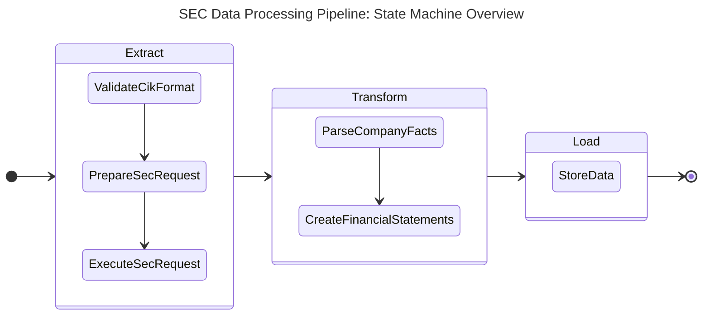
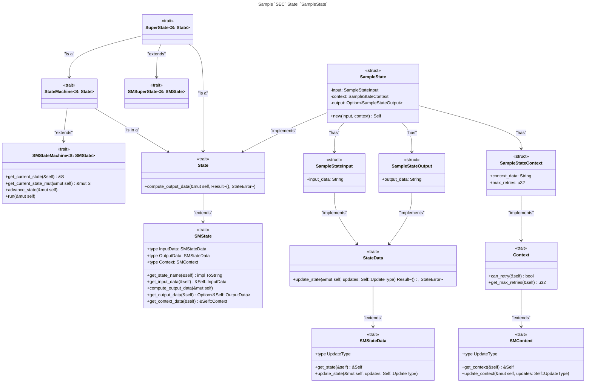
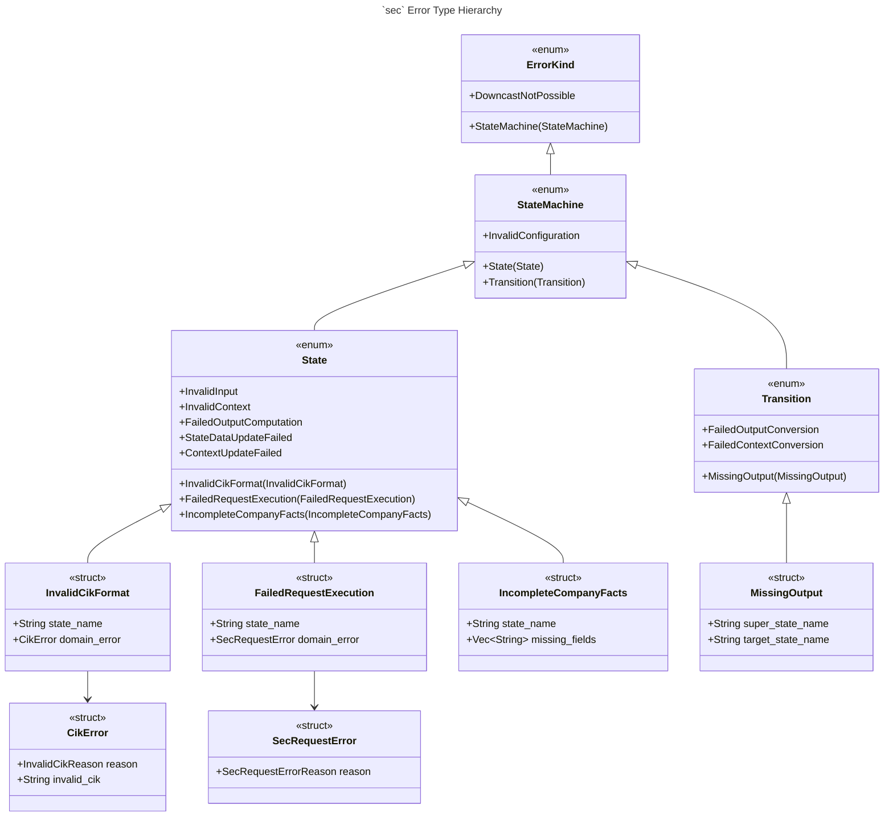

# Arkad

Arkad is a production-grade financial data engineering framework written in Rust, built on a hierarchical finite state machine (HFSM) foundation. It provides invariant-based, type-safe, and testable ETL pipelines for processing financial data — starting with SEC filings — with predictable execution semantics, structured error handling, and support for asynchronous and parallel execution.

## Architecture

Arkad is structured as a Rust workspace with two crates:

### `state_maschine`

A general-purpose HFSM library providing the core trait abstractions and execution model that all pipelines are built on. Designed to be extended for domain-specific use cases without modification to the core.

### `sec`

Extends `state_maschine` for processing SEC filings — handling data acquisition, validation, transformation, and storage in a structured, type-safe pipeline.

## Design

### ETL Pipeline as a Hierarchical State Machine

The SEC processing pipeline is modelled as a three-stage HFSM: `Extract`, `Transform`, and `Load`. Each super-state encapsulates its own internal states and transitions, enforcing clean separation of concerns and deterministic execution.



### Trait Hierarchy

Each pipeline state implements a layered trait system that enforces correctness at compile time. The SEC-specific `State`, `StateData`, and `Context` traits extend base abstractions from `state_maschine`, enabling reuse of the execution engine while allowing full domain customisation.



### Error Type Hierarchy

Errors are modelled as a structured hierarchy — from top-level `ErrorKind` down through `StateMachine`, `State`, and `Transition` variants — with each layer wrapping strongly-typed domain errors. This makes all failure modes explicit, exhaustively matchable, and traceable to their origin.



## Quality & Reliability

- **1,000+ unit tests** covering state transitions, input validation, error paths, and edge cases
- **Invariant-based validation** at every state boundary to prevent downstream data corruption
- **Async and parallel execution** via Tokio, preserving pipeline correctness and reproducibility
- **First-class CI** via GitHub Actions with automated testing, linting, and formatting checks
- **Devcontainer support** for reproducible development environments

## Getting Started

Make sure Rust is installed:

```bash
cargo --version
```

If you get a `command not found` error, install the Rust toolchain via [rustup](https://rustup.rs/) or your distro's package manager.

Clone the repository:

```bash
git clone https://github.com/ironcapitaleu/arkad.git
cd arkad
```

Run the full ETL pipeline (Extract + Transform) with structured JSON logging:

```bash
# All S&P 500 CIKs (3 concurrent)
cargo run --features tracing-logging --bin stream_etl
```

## Contributing

See [CONTRIBUTING.md](CONTRIBUTING.md) for guidelines. All contributions are welcome.
