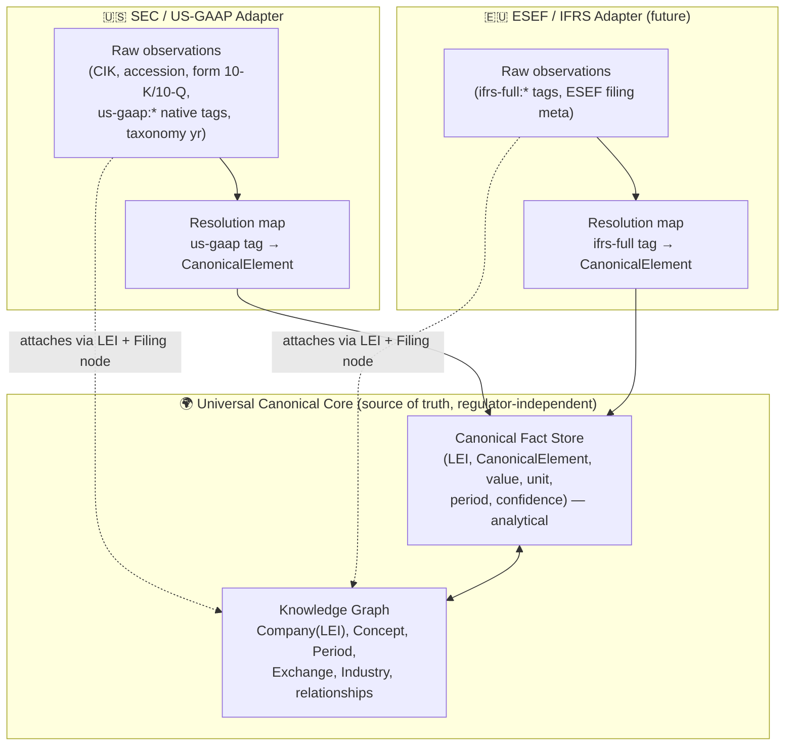
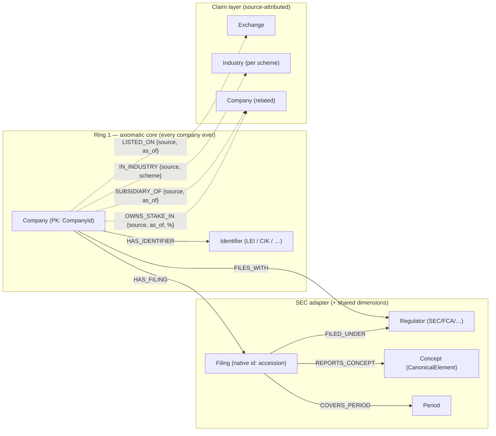
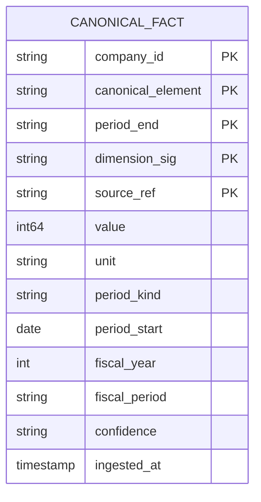
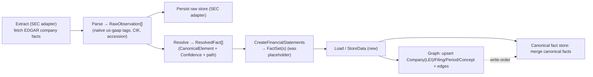

# Universal Company Data Model — Canonical Core + Regulator Adapters

> **SPIKE findings for [STA-130](https://linear.app/state-machine/issue/STA-130/spike-design-hybrid-data-model-graph-knowledge-base-analytical-data).**
> Status: findings complete — logical model settled (§2–§12); **physical deployment deliberately
> deferred (decision 2026-08-08): storage is fully abstracted behind the `storage` crate's ports
> (§14.F), and the physical choice waits for a measured trigger (§14).**
> Owner: Damir Catovic. Date: 2026-07-21 (rev. 2026-08-08).

## 1. Context & Guiding Requirements

`arkad` normalizes company financial data and serves screeners, dashboards, and
data-quality checks. This SPIKE decides the **persistence data model**. Three
requirements drive the design:

1. **A universal, regulator- and jurisdiction-independent model** that works for *any*
   company worldwide — not SEC-specific, not US-GAAP-specific. This is the **source of
   truth**.
2. **Regulator-specific data (SEC/EDGAR first, later FCA, BaFin, ESEF/IFRS) connects to
   the universal core and stays independently queryable** — CIK, accession numbers, native
   `us-gaap` tags, and form types are first-class *within their adapter*, joinable to the
   universal model but never leaking into it.
3. **Accounting correctness** — normalization obeys SFAC-6 element definitions and the five
   accounting identities; every normalized fact is traceable back to the raw filing tag it
   came from.

### 1.1 The current codebase is an immature seed, not the target

The design below is a **redesign**, not a preservation of what exists. Today the workspace
has two parallel, non-integrated models and no persistence:

- `sec` crate (live): `CompanyData → HashMap<&ConceptDefinition, CompanyFact> → Vec<Observation>`,
  identity is **`Cik`-centric** (SEC-specific), concept resolution is string-alias matching.
- `xbrl` crate (dormant, not referenced by the pipeline): `CanonicalElement` (42 SFAC-6-rooted
  variants), `ResolvedFact` (with a `Confidence` ladder + `resolution_path`), `FactSet`,
  `Invariant` validation, and a graph-engine **TODO stub**.
- Pipeline runs **Extract → Transform** only. `CreateFinancialStatements` emits a placeholder
  unit struct; the entire **Load SuperState is an empty file**.

What to carry forward vs. change (detail in §10):

| Existing artifact | Verdict |
| --- | --- |
| `xbrl::CanonicalElement` (SFAC-6 vocabulary) | **Keep & promote** — this *is* the universal concept layer, but decouple it from the `us_gaap` module so it is standard-neutral |
| `xbrl::ResolvedFact` + `Confidence` + `resolution_path` | **Keep & promote** — becomes the universal `CanonicalFact`, minus SEC specifics |
| `xbrl::Invariant` (SFAC-6 identities) | **Keep** — universal validation |
| `us_gaap::mappings` (tag → CanonicalElement) | **Reframe** — this is *one adapter* (SEC/US-GAAP), not the core |
| `sec::Cik`-centric identity, `FilingSource` (accession/form) | **Scope to the SEC adapter** — `Cik` stays first-class: it is the adapter's primary key and the natural entry point of SEC pipelines (§11); *core* identity keys on **`CompanyId`** (LEI-preferred, §4), resolved at load time |
| `sec::CompanyData/CompanyFact/Observation` | **Replace** — superseded by the canonical model |

## 2. Architectural Spine — Universal Core + Regulator Adapters (Hub & Spoke)



**Principle:** an adapter's job is to (a) retain the regulator's raw data verbatim and
queryable, and (b) *resolve* native taxonomy tags into the universal `CanonicalElement`
vocabulary, writing normalized facts into the core. The core never contains a `us-gaap`
string, a CIK, or a 10-K form code. A company that files nowhere still exists in the core
(identity + relationships); a company that files with three regulators has three adapters'
worth of raw data all resolving into **one** canonical fact history.

**What resolves vs. what stays in the adapter:** only observations that resolve to a
`CanonicalElement` (at a known `Confidence`) are promoted to the core. Anything regulator-
specific that has no canonical meaning (e.g. a bespoke `us-gaap` disclosure tag with no
SFAC-6 mapping) **remains in the adapter, fully queryable**, but is not forced into the
universal model. This is precisely the "connect to and query regulator-specific data"
requirement.

### 2.1 Two rings inside the core: axiomatic vs derived (multi-adapter rule)

"Source of truth" needs precision — the core has two rings with different epistemic status
(review resolution, 2026-08-08):

- **Axiomatic ring — identity & structure.** `Company`, its `Identifier`s, the adapter
  bridges: only what is **independently verifiable against an authoritative registry** (GLEIF
  says this LEI exists; EDGAR says this filing exists). This ring is what §8 means by "graph =
  source of truth."
- **Derived ring — normalized data.** Canonical facts (§6) and completeness edges are
  **materializations computed from adapter data**, never axiomatic. Every datum carries
  provenance (`source_ref`, `confidence`) and all of it is rebuildable by replay (§8). Values,
  units, and periods in the core are therefore not "core truth" — they are normalized
  *projections of* adapter observations, always traceable back to one.
- **Query routing works in both directions** (§7.1): query an adapter directly by its native
  PK (`Cik` against the SEC adapter), or query the universal `Company` by `CompanyId`/LEI and
  let the core delegate to whichever adapters hold data for it.

**Multi-adapter rule:** when several adapters normalize data for the same company, their
outputs are **never destructively merged**. The §6 grain includes `source_ref`, so canonical
facts from different adapters coexist as separate provenance-attributed rows. Example: a
dual-listed filer reports FY2024 revenue via a 10-K (`us-gaap`, SEC adapter) *and* an ESEF
report (`ifrs-full`, ESEF adapter) → **two rows** for (company, `Revenue`, FY2024), one per
`source_ref`. **Agreement across sources upgrades confidence** (cross-source validation);
divergence is surfaced as a data-quality finding; "which value wins" is **read-time policy**
(e.g. prefer the primary regulator), never a write-time overwrite. The graph applies the same
posture to relationship claims (§5.2).

## 3. Universal Canonical Concept Model

The universal vocabulary is the **SFAC-6-rooted `CanonicalElement`** set (13 Level-1 roots +
~29 Level-2 sub-elements; already enumerated in `xbrl/src/core/elements.rs`). SFAC-6 is a
US document, but its ten elements are **definitional, not standard-specific** — IFRS's
Conceptual Framework defines assets, liabilities, equity, income, and expenses in
substantially the same terms. So the roots are a legitimate *cross-standard* canonical
layer; US-GAAP and IFRS are two **dialects** that resolve into it.

### 3.1 Standard-neutrality — how divergences are handled

- **Roots always map.** Assets/Liabilities/Equity/Revenue/Expenses/Gains/Losses/
  NetIncome/OCI/ComprehensiveIncome/{Operating,Investing,Financing}CashFlow hold under both
  US GAAP and IFRS.
- **Level-2 sub-elements may diverge** (e.g. IFRS bars LIFO inventory; development costs may
  be capitalized under IFRS but expensed under US GAAP; statement groupings differ). Rule:
  where a dialect concept has no faithful canonical sub-element, it is **not** force-fitted —
  it stays a raw adapter observation (queryable) and, if material, motivates a new
  `CanonicalElement` variant added deliberately (via the accounting checklist), never an
  overload of an existing one.
- **Invariant:** never map two different concepts to the same `CanonicalElement` for the
  same period/dimension.

### 3.2 Universal validation (SFAC-6 identities)

The core enforces the five identities as data-quality checks (`xbrl::Invariant`):

1. Assets = Liabilities + Equity
2. Net Income = Revenue − Expenses + Gains − Losses
3. Comprehensive Income = Net Income + OCI
4. ΔEquity = Comprehensive Income + Investments − Distributions
5. Operating CF + Investing CF + Financing CF ≈ ΔCash

Identity #1 failing is always a system bug, never valid company data. Balance-sheet
elements are **Instant**; flow elements are **Duration** — this classification is intrinsic
to the `CanonicalElement`, not to any regulator.

### 3.3 Resolution & confidence (the adapter mechanism, made universal)

Each adapter resolves a raw tag → `CanonicalElement` via the 4-tier ladder, tagging the
resulting fact with its `Confidence`:

| Tier | Confidence | Mechanism |
| --- | --- | --- |
| 1 | `Exact` | direct canonical concept match |
| 2 | `Synonym` | alias list (dialect-specific, e.g. `Revenues`, `SalesRevenueNet`) |
| 3 | `Derived` | SFAC-6 identity / calculation-linkbase children (`parent = Σ childᵢ·weightᵢ`) |
| 4 | `Computed` | full taxonomy linkbase graph traversal |

`resolution_path` records the trace (which tag(s), which derivation) so any canonical fact
is explainable back to the regulator dialect it came from.

### 3.4 Dimensions

XBRL facts can be dimensionally qualified (segment, geography, product). The canonical fact
grain therefore includes an optional **dimension signature** (a set of
axis→member pairs). The unqualified (consolidated total) fact has an empty signature.
Dimensional members are themselves adapter-specific vocabularies that may later gain
canonical mappings; the core stores the signature so screeners can request totals or a
specific segment without the adapter.

## 4. Universal Identity

- **Primary key: `CompanyId` — our own platform-owned newtype, not raw LEI.** What the model
  presupposes is *one global PK*, **not** that every entity has an LEI. `CompanyId =
  Lei(..) | Cik(..) | …`; the platform keys everything (facts, graph nodes, provenance) on
  `CompanyId`, so the identity *scheme* can evolve — or fall back — without exposing the whole
  data platform to LEI availability. (The same shielding-newtype pattern this repo already
  uses for domain concepts.)
- **LEI is the preferred/canonical scheme** (ISO 17442, 20-char, GLEIF-issued — global and
  regulator-agnostic). A validated `Lei` newtype is added under `shared/` (sibling to the
  existing `Cik`), built with the `domain-concept` pattern (format + ISO 17442 check-digit
  validation).
- **LEI cannot be presupposed for every entity — concrete gaps:** LEIs are mandatory mainly
  for entities party to regulated financial transactions (EMIR/MiFID-style obligations); many
  SEC registrants (smaller reporting companies, some foreign private issuers, trusts/shells)
  have never obtained one; issued LEIs **lapse** when annual renewal stops; and private
  companies appearing only in ownership claims (§5.2) often have no LEI at all.
- **CIK is not core — but it is first-class inside the SEC adapter:** the adapter's primary
  key and the natural entry point of SEC pipelines. The CIK↔LEI mapping is how the SEC adapter
  attaches its data to the universal company (§11).
- **Fallback & relink invariant.** A company first seen via SEC with no LEI is keyed on
  `CompanyId::Cik(..)` and **relinked to LEI later without rewriting facts** (facts key on the
  resolved `CompanyId`; the graph carries all known identifiers as `Identifier` nodes, §5.1).

## 5. Universal Knowledge Graph (Knowledge-Base Layer)

Models **identity, structure, and relationships** for every company worldwide. Reworked per
PR review (2026-08-08): built **from the minimal axiomatic core outward** — start with the
non-negotiables that hold for *every company ever*, then the SEC adapter, then the bridge
between them. Everything not independently verifiable (classifications, relationships) enters
as a **source-attributed claim** (§5.2), never as core truth. Keep the model minimal but
extensible.

### 5.1 Nodes — three rings

| Node | Ring | Key | Notes |
| --- | --- | --- | --- |
| `Company` | **core — axiomatic** | `company_id` (§4) | *the* non-negotiable node; entity_name, country, status |
| `Identifier` | **core — axiomatic** | `(scheme, value)` e.g. `(LEI, …)`, `(CIK, …)` | identity records attached to `Company`; each verifiable against its issuing registry (GLEIF, EDGAR) |
| `Concept` | core — ours by construction | `CanonicalElement` | our own vocabulary — axiomatic because *we* define it (enables "which concepts expected/missing") |
| `Period` | shared dimension | `(kind, key)` e.g. `FY2024`, `Q3-2024` | deterministic calendar construct (Instant/Duration) — verifiable by arithmetic, safe to share |
| `Regulator`/`DataSource` | adapter-bridge | `code` (SEC, FCA, BaFin, ESMA) | |
| `Filing` | adapter | `regulator + native_id` (SEC: accession) | form, filed_date, period_end, taxonomy version |
| `Exchange` | reference data | `mic` (ISO 10383) | the *list* is a verifiable standard; any given *listing* is a claim (§5.2) |
| `Industry`/`Sector` | **claim layer — not core** | `scheme+code` (GICS/SIC/NACE) | classifications are source-owned opinions (GICS is S&P/MSCI's, SIC is the SEC's), multi-label, and disagree across schemes — attached only via source-attributed `IN_INDUSTRY` claims |

**Build order (review directive):** ring 1 (`Company` + `Identifier`) → the SEC adapter
(`Regulator`, `Filing` + structural edges) → the bridge (`HAS_FILING` via CIK→`CompanyId`
resolution, §11). Claim-layer nodes enter only as their sources are onboarded.

### 5.2 Edges — structural vs claims

**Structural edges** — adapter-verifiable (a filing either exists in EDGAR or it doesn't):

| Edge | From → To | Properties |
| --- | --- | --- |
| `HAS_IDENTIFIER` | Company → Identifier | since, status (active / lapsed) |
| `HAS_FILING` | Company → Filing | (Filing is adapter-owned but hangs off the core company) |
| `FILED_UNDER` | Filing → Regulator | |
| `FILES_WITH` | Company → Regulator | first_filed |
| `COVERS_PERIOD` | Filing → Period | |
| `REPORTS_CONCEPT` | Filing → Concept | resolved confidence (structural completeness) |

**Relationship edges — source-attributed claims.** A relationship assertion is only as good
as its source, and sources disagree: `A OWNS_STAKE_IN B: 42% as of 2026-01-31 per S1` can
coexist with `… 53% as of 2026-01-16 per S2` (different `as_of` — a legitimate time series,
not a conflict) *and* with `… 53% as of 2026-01-31 per S2` (same `as_of` — a genuine
conflict). So every relationship edge carries a uniform **claim envelope** beside its payload:

- `source` — which adapter/dataset asserted it (provenance, §8.2)
- `as_of` — the date the assertion is *about*; `observed_at` — when we ingested it
- `verifiability` — `Verified` (regulatory filing / official registry) · `Reported`
  (reputable aggregator or data vendor) · `Alleged` (news, unconfirmed)

| Edge (claim) | From → To | Payload |
| --- | --- | --- |
| `LISTED_ON` | Company → Exchange | ticker, listing_date |
| `IN_INDUSTRY` | Company → Industry | scheme |
| `SUBSIDIARY_OF` | Company → Company | since |
| `OWNS_STAKE_IN` | Company → Company | percentage |

Rules: claims are **append-only and never destructively merged** — conflicting claims
coexist; which one "wins" is **read-time policy** (most-recent `as_of`, highest
verifiability, or "show all with sources"); cross-source **agreement upgrades confidence**,
divergence is itself a data-quality signal to surface — the same posture as the fact store's
multi-adapter rule (§2.1).

**Data-quality checks per element** (anchoring the review ask "how do we check consistency
for each of these"):

| Element | Check |
| --- | --- |
| `Company` | has ≥ 1 `Identifier`; exactly one *primary* id; no orphan companies |
| `Identifier` | validates against its scheme (LEI check digit, CIK format); LEI: GLEIF status current (issued, not lapsed) |
| `HAS_FILING` / `Filing` | filing exists verbatim in the adapter raw store (§8 drift check) |
| `COVERS_PERIOD` | period arithmetic consistent (dates ↔ fiscal year; four quarters ≈ FY, §5.4) |
| `REPORTS_CONCEPT` | expected-concept set for the form type covered (completeness, §5.4) |
| ownership claims | `percentage ∈ (0, 100]`; `as_of ≤ observed_at`; conflict detector: same edge + same `as_of`, different payloads |

### 5.3 Diagram



### 5.4 Two workloads under one "graph" label

The knowledge-graph *modeling* lens covers two very different **query shapes**, and conflating
them oversells the need for a graph *engine*. Separating them sharpens the storage decision
(§13–§14):

**(a) Structural completeness — relational-shaped (bounded, shallow).** Despite the "graph"
framing, these are set/aggregate operations, not traversals — a row store does them *better*
than a graph engine:

- _"Which companies are missing a Q3-2024 quarterly report?"_ → an **anti-join**.
- _"Does FY2024 have all four quarters?"_ → a **GROUP BY / count**.
- _"Which required concepts did this filing fail to report?"_ → a **set difference** between
  expected `Concept`s and the filing's `REPORTS_CONCEPT` edges.

  1-hop edges (`HAS_FILING`, `COVERS_PERIOD`, `REPORTS_CONCEPT`) are just indexed joins. This
  is the **completeness engine**, and it stays comfortable in Postgres at the stated scale.

**(b) Relationship traversal — genuinely graph-shaped (deep, variable-depth).** The
`SUBSIDIARY_OF` / `OWNS_STAKE_IN` edges form corporate ownership networks:

- _"Ultimate parent of company X"_, _"full beneficial-ownership tree"_, _"all cross-holdings
  between two groups"_ → **recursive, multi-hop** traversals.

  Here a native graph engine (index-free adjacency, Cypher) materially beats recursive CTEs,
  which grow verbose and degrade with depth/branching.

**Consequence for the decision:** completeness (a) does *not* justify a graph database;
relationship traversal (b) is the only workload that does. So the §14 trigger for adopting a
dedicated graph store is specifically *"when multi-hop ownership/relationship analysis becomes
central,"* not the data-quality checks.

## 6. Universal Canonical Fact Store (Analytical Layer)

A columnar fact table — regulator-agnostic — one row per canonical observation. **Grain:**
`(company_id, canonical_element, period, dimension_signature, source_ref)`.

| Column | Type | From | Notes |
| --- | --- | --- | --- |
| `company_id` | string | `CompanyId` (LEI preferred) | partition/cluster key |
| `canonical_element` | enum | `CanonicalElement` | universal concept |
| `value` | int64 | `ResolvedFact.value` | integer minor units (currency) or scaled |
| `unit` | string | `Unit` | ISO 4217 currency, `shares`, `pure`, … |
| `period_kind` | enum | `Period` | Instant / Duration |
| `period_start` | date? | `Period::Duration.start` | null for Instant |
| `period_end` | date | `Period` | Instant.date or Duration.end |
| `fiscal_year` | int | `FiscalYear` | reporting entity's fiscal calendar |
| `fiscal_period` | enum | `FiscalPeriod` | Q1..Q4 / FY |
| `dimension_sig` | string? | dimension signature | null/empty = consolidated total |
| `confidence` | enum | `Confidence` | Exact/Synonym/Derived/Computed |
| `resolution_path` | list<string> | `ResolvedFact.resolution_path` | traceability |
| `source_ref` | string | (generic) | **opaque handle to the adapter filing** (e.g. `sec:accession`) — the only link out to a regulator |
| `ingested_at` | timestamp | (load) | idempotency/audit |

Note what is **absent**: no `cik`, no `form`, no `accession_number` column, no `us-gaap`
tag. Provenance to a specific regulator filing is a single opaque `source_ref` that resolves
into the adapter (§7) — keeping the fact store universal while still fully traceable.



### 6.1 Yes — this *is* the time series (long form)

The review asks whether facts are "better modeled as a time series" — they **are** one: the
fact table is the standard **long/tidy form** of a time series, and a series is a *view* on
it. `WHERE company_id = ? AND canonical_element = 'Revenue' AND dimension_sig = '' ORDER BY
period_end` *is* Apple's revenue over time. Long form is chosen over per-series containers
(one array/table per company × concept) because:

- **Heterogeneous & sparse** — thousands of concepts × dimensions, most absent for most
  companies; per-series containers multiply empty structures.
- **Restatements are vintages** — `source_ref` in the grain lets original and amended values
  for the same (element, period) coexist; an array-per-series cannot represent overlapping
  vintages without reinventing exactly this table.
- **Columnar engines are built for long form** — §12b's lakehouse / `pg_duckdb` path is
  precisely the "scan a long fact table" workload; time-series-native access patterns
  (per-concept series, rolling windows) are cheap projections over it.

Materialized per-concept series (wide tables for hot screener paths) are **read-side
projections built on demand — never the storage of record.**

## 7. Regulator Adapter Layer (SEC/EDGAR concrete)

Each adapter owns three things, all **independently queryable** and joinable to the core by
`company_id` + `source_ref`:

1. **Raw observation store** — every native fact as filed, verbatim:
   `cik`, `accession_number`, `form` (10-K/10-Q/8-K/20-F), `filed_date`, `period_end`,
   `taxonomy_version`, `native_tag` (e.g. `us-gaap:RevenueFromContractWithCustomerExcludingAssessedTax`),
   `value`, `unit`, `period`, `dimensions`. This is the replay source and the "SEC-specific
   query" surface.
2. **Resolution map** — dialect tag → `CanonicalElement` with priority-ordered aliases
   (today's `us_gaap/mappings.rs`, reframed as the SEC adapter's map). Drives promotion of
   raw observations into core canonical facts.
3. **Filing metadata → graph** — creates the `Filing` node + `HAS_FILING`/`FILED_UNDER`/
   `COVERS_PERIOD`/`REPORTS_CONCEPT` edges and resolves CIK→LEI to attach to the core company.

### 7.1 Querying in both directions

- **Universal → regulator-specific:** start from any `Company` (worldwide) in the core, fetch
  canonical facts; drill down via `source_ref` to see the exact SEC filing + native
  `us-gaap` tag that produced a number ("what tag did Apple's FY2024 Revenue come from?").
- **Regulator-specific → universal:** start from an SEC concept (`by CIK`, `by form`, `by
  us-gaap tag`) in the adapter, resolve CIK→LEI, and pull the universal normalized history
  ("give me every company that reported `us-gaap:Goodwill`, as canonical `Goodwill`").

## 8. Consistency Model & Layer Hierarchy

- **Graph = source of truth** for identity, structural metadata, completeness — and the
  *ledger* of relationship claims, which stay per-source and append-only (§5.2) rather than
  being merged into one "true" relationship.
- **Canonical fact store = authoritative** for canonical numeric values/time-series.
- **Adapter raw store = the replay source** (system of record for what was actually filed).
- **Write order:** adapter raw ingested → graph nodes/edges upserted → canonical facts
  written. A canonical fact may only reference a `source_ref`/company the graph already knows.
- **Recoverability:** the graph and the canonical fact store are both **rebuildable from the
  adapter raw stores** by replaying resolution. So the raw stores are the durable system of
  record; core layers are materializations that can be dropped and rebuilt (a major
  simplifier for schema evolution and for trusting the normalization).
- **Drift handling:** reconciliation compares graph `Filing`s vs. distinct `source_ref`s in
  the fact store vs. the adapter raw set; the symmetric difference is the drift report.
  Canonical facts with no known filing are quarantined; filings with no canonical facts are a
  completeness gap (surfaced by traversal).

### 8.1 Data-Quality Model (completeness + invariants + confidence)

Data quality is enforced on **two independent axes**, mapping onto the two core tiers:

1. **Structural completeness — graph tier.** Expected structure is modeled, so gaps are
   *absences in a traversal*: missing filings/periods/concepts (§5.4). Store mechanics:
   Postgres → recursive CTE / anti-join; graph DB → a Cypher/traversal pattern that fails to
   match; lakehouse → not its job (completeness stays in the graph tier).
2. **Value-level invariants — canonical fact tier.** The five SFAC-6 identities
   (`xbrl::Invariant`), rollup consistency (`parent ≈ Σ childᵢ·weightᵢ` within a threshold),
   and confidence/traceability. Failure kinds mirror `ValidationErrorKind`:
   `IncompleteData`, `InconsistentIdentity`, `ImpreciseRollup`. Identity #1
   (Assets = Liabilities + Equity) failing is always a system bug, never valid data.

Where checks run: (a) **at load** — post-materialization validation before facts are marked
`published`; (b) **as scheduled audits** — over the whole store; (c) **on drift** — the §8
reconciliation. On failure, facts are **quarantined** (not deleted) and, because the raw
store is the rebuildable SoT, can be recomputed after a resolution/mapping fix. Every fact
carries `confidence` + `resolution_path`, so a data-quality report is explainable down to the
native tag it came from.

Storage mechanics by option: **Postgres** → SQL aggregate checks + CHECK-style assertions +
materialized views for scheduled audits; **graph DB** → completeness natively, invariants
still computed at the fact tier; **Iceberg** → invariant/rollup batch jobs via DataFusion /
DuckDB / any lakehouse engine (see §12a on polyglot access).

### 8.2 Provenance Model

Provenance is the platform's highest-value metadata — it is what makes every number
trustworthy, auditable, and independently verifiable. It splits into **two kinds** with
different natural homes:

1. **Source provenance** — *which filing* a fact came from: accession, form, `filed_date`,
   regulator, native `us-gaap` tag, taxonomy version. **Tabular** (one origin per observation).
2. **Derivation provenance** — *how* a canonical fact was computed: `confidence` +
   `resolution_path`. For `Exact`/`Synonym` it is a single tag; for `Derived`/`Computed` it is
   a **DAG** (e.g. `Liabilities = LiabilitiesCurrent(+1) + LiabilitiesNoncurrent(+1)`, each
   from a specific accession) — i.e. the calculation-linkbase structure itself.

Insight: derivation provenance is **graph-shaped**, so the graph tier is its natural home;
source provenance is happiest as flat rows/columns.

**Hot-path rule.** The canonical fact row carries only `confidence` (a low-cardinality filter
column) + `source_ref` (an opaque pointer into the adapter). Full provenance is a **drill-down**,
never scanned during analytical aggregation — keeping screener scans lean.

**Storage shape by option:**

| | Postgres | Lakehouse (columnar) | Graph DB |
| --- | --- | --- | --- |
| Source provenance | `source_ref` FK → `raw_observation`/`filing` tables (normalized) | can be **inlined denormalized** — repeated accessions **dictionary/RLE-compress to ~nothing**; wide flat fact tables are idiomatic | edge property / `(Fact)-[:FROM]->(Filing)` |
| Derivation (`resolution_path`) | JSONB column or `fact_input` join table (fact ↔ inputs, weight+role) | nested/list Parquet column or lineage table | **native** — `(Fact)-[:DERIVED_FROM {weight}]->(Observation)` |

A genuine difference falls out: **columnar is *better* at inlining source provenance** (its
repetition compresses for free), while **the graph is *better* at derivation lineage**;
Postgres is the balanced middle.

**Population.** Provenance is a **write-once byproduct** of the raw-first order (§8): the raw
observation *is* the source provenance (written first); the fact references it in the same
transaction/commit; the resolution engine emits `resolution_path`/`confidence` as it resolves.
Provenance is **append-only and immutable** — a fact's origin never changes; a restatement is a
*new* fact with *new* provenance, the old retained for audit (amendment supersedes,
accession-keyed). Immutability means no UPDATE churn (Postgres) and no merge-on-read
(lakehouse) — the one place lakehouse writes are easy.

**Querying & performance.** Point drill-down ("provenance of this fact") is cheap everywhere.
Reverse/analytical queries ("all `Derived` revenue", "all facts from filing X") index
`confidence`/`source_ref`; columnar predicate-pushdown on `confidence` excels. "What breaks if
filing X is restated?" walks `DERIVED_FROM` backward — the payoff for storing derivation as a
graph. Deep multi-hop lineage for `Computed` facts is the only expensive case, and it is a
drill-down, not a hot path.

**Maintenance & retention.** Append-only → low churn, but it grows unboundedly (an audit
trail). Partition/archive by period; and because the raw store is the rebuildable SoT (§8),
detailed lineage may be treated as **reproducible** rather than stored forever. Provenance is
also a **compliance asset** — "where did this number come from, and how was it derived" is
exactly the auditability financial data requires.

**Serving (API).** Expandable, not default: `GET /facts/{id}` → `{value, unit, confidence}`;
`GET /facts/{id}/provenance` → full lineage (filing + native tag from the adapter raw store,
plus the derivation DAG from the graph). The endpoint **composes across tiers** — a local join
in Option A (single Postgres), a cross-store stitch in Option B. Product-facing, this is an
**explainability/trust surface**: *"FY2024 Revenue is `Synonym`-matched from
`us-gaap:SalesRevenueNet` in accession 0000320193-24-…, filed 2024-11-01."* Because it grounds
in the polyglot raw SoT (§12a), it is independently verifiable. (Provenance drill-down being a
local join is a mild point toward Option A.)

## 9. Mapping the Transform Pipeline Onto the Model

Today: `ParseCompanyFacts → CompanyData`; `CreateFinancialStatements → placeholder`; Load absent.



- **Resolution moves earlier and becomes the adapter boundary:** `ParseCompanyFacts` emits
  `RawObservation`s (already implemented in `xbrl::sec_api::company_facts::parse`); a new
  resolve step turns them into `ResolvedFact`s. `CreateFinancialStatements` stops emitting a
  placeholder and emits `FactSet`s (the intermediate representation — no extra DTO needed).
- **Load/`StoreData`** is the dual-writer: raw store (adapter) → graph → canonical facts.
- `sec::CompanyData/Observation/ConceptDefinition` are **retired** in favor of
  `xbrl::FactSet/ResolvedFact/CanonicalElement`; this SPIKE is the trigger for that
  sec→xbrl migration flagged in the ticket's Additional Notes.

## 10. Migration From the Current (Immature) Skeleton

| Step | Action |
| --- | --- |
| 1 | Promote `xbrl::core` (CanonicalElement, ResolvedFact, FactSet, Confidence, Invariant, Period, Unit) to the **standard-neutral core**; decouple `CanonicalElement` from the `us_gaap` module namespace. |
| 2 | Reframe `xbrl::us_gaap` as the **SEC/US-GAAP adapter** (raw parse + resolution map + filing metadata). Keep `sec_api::company_facts::parse`. |
| 3 | Add `Lei` domain concept + `CompanyId` enum under `shared/`; add CIK→LEI translation to the SEC adapter. |
| 4 | Implement the resolution engine (`xbrl::core::graph` TODO stub) — the 4-tier ladder + calc-linkbase derivation. |
| 5 | Wire `CreateFinancialStatements` to emit `FactSet`s; retire `sec::CompanyData`. |
| 6 | Implement the **Load SuperState / `StoreData`** as the dual-writer over the chosen storage tech (§11–12). |

## 11. LEI & CIK↔LEI Translation (SEC-adapter concern)

- **Obtain LEI:** GLEIF public API / bulk "golden copy"; SEC does not key on LEI, so the
  adapter maintains CIK→LEI.
- **Minimal viable → automated:** (1) static hardcoded map now (mirrors the sample CIKs in
  `cik/constants.rs`); (2) batch cross-reference GLEIF golden-copy × SEC ticker/CIK map;
  (3) on-demand GLEIF API lookup at ingest with cache. Ambiguous/missing → key on CIK,
  flag for review, backfill LEI later without rewriting facts.
- **SEC pipelines start from `Cik`, and that is fine.** The ETL takes a `Cik` as input;
  identity resolution to `CompanyId` happens **at the Load step** — Extract/Transform stay
  purely SEC-native and are never blocked on LEI availability.
- **What the LEI actually does at ingestion time** (the review question), concretely:
  1. **Resolve** — `Cik → CompanyId` (LEI if mapped, else `CompanyId::Cik`).
  2. **Attach** — upsert the core `Company` node and hang the new `Filing` off it; the
     resolved id is the graph attach point — this is what keeps one canonical company across
     regulators instead of one shadow company per adapter.
  3. **Check** — data quality at the identity seam (§5.2 table): LEI check digit, GLEIF
     status (issued vs lapsed), entity-name cross-check between the GLEIF record and the
     filing.
  4. **Degrade gracefully** — a missing/ambiguous mapping never blocks ingestion: proceed
     CIK-keyed, flag for review, backfill the LEI later (relink invariant, §4).

## 12. Batch vs. Incremental

Both modes idempotent, raw→graph→canonical ordered:

- **Batch (backfill):** for a company set, ingest all historical filings into the adapter
  raw store, then materialize graph + canonical facts. Dedupe on natural key
  `(company_id, canonical_element, period_end, dimension_sig, source_ref)`.
- **Incremental:** triggered by a newly detected filing (SEC EDGAR `submissions`/RSS feed;
  polling first, push later). Adapter ingests the new filing; graph gains the `Filing` node
  + edges (flipping any completeness gap to satisfied); canonical facts merge.
- **Restatements/amendments:** a new accession → new raw + canonical rows; prior rows retained
  for audit; "latest" resolved by `filed_date` (amendment supersedes original — a domain
  invariant from the accounting skill).

## 12a. Design Principle — Language-Agnostic Data Layer

The ingestion/normalization **application** is Rust, but the **persisted data must not be
Rust-locked**. The maturity risks surfaced in §13 are really *Rust-binding* risks (pre-1.0
crates, an embedded engine tied to the Rust process). They are avoided by choosing **open
formats and standard wire protocols** for the data layer, so the data is readable by many
engines and languages — and outlives any single binding:

- **Open table format (Iceberg / Parquet)** — data in object storage, readable by Rust,
  Python (PyIceberg), DuckDB, DataFusion, Spark, Trino, Snowflake, BI tools. The Rust crate
  being pre-1.0 does not lock the data in; a screener frontend, a Python notebook, or a future
  service can read the same tables directly.
- **Standard SQL wire protocol (Postgres)** — drivers in every language; the store is not
  hostage to one library's maturity.
- **Avoid embedded Rust-only engines** for the SoT (e.g. an in-process graph tied to the Rust
  binary) — they are language- and process-locked.

Consequence: the **canonical fact store's intended destination is an Iceberg lakehouse**
(open, polyglot, columnar), with Postgres as the low-burden on-ramp; the raw stores and any
graph tier should likewise favor polyglot-accessible stores over Rust-embedded ones.

## 12b. Workload Profile & Serving Layer

Population (writes) and querying (reads) are **different workloads**, and each physical option
optimizes a different one. The "raw = source of truth, graph + facts = rebuildable
materializations" shape (§8) is effectively **CQRS**: write once into raw, project into
read-optimized shapes. This section characterizes both sides and how they sit behind an API.

### 12b.1 Write path (population)

Bursty, batch-or-incremental, driven by the **Rust ETL — not user traffic**. Two modes:
**backfill** (bulk) and **incremental** (one filing ≈ a few hundred rows). Idempotent upserts;
restatements are point corrections (new fact, accession-keyed).

### 12b.2 Read path (querying)

User-facing, read-heavy, three shapes: **point lookups** ("Apple's FY2024 revenue"),
**analytical scans** ("all software companies with ROE > 15%"), **traversals** ("ultimate
parent of X").

### 12b.3 Per-store behaviour

| Workload | Postgres (row) | Lakehouse (Iceberg/Parquet, columnar) | Graph DB |
| --- | --- | --- | --- |
| Backfill (bulk write) | good (`COPY`) | **excellent** (big appends) | ok (bulk import) |
| Incremental (small write) | **excellent** (`INSERT … ON CONFLICT`) | **weak** — tiny commits → many small files → compaction | good (`MERGE`) |
| Restatement / point update | **trivial** (`UPDATE`) | **expensive** (merge-on-read / rewrite) | good |
| Point-lookup read | excellent (indexed) | good | good |
| Analytical scan / aggregation | ok at low-millions, degrades | **excellent** (columnar, 10–100×) | poor |
| Deep traversal | weak (recursive CTE) | poor | **excellent** |

Headline tension: **the lakehouse is the best reader for screeners but the worst writer for
incremental filings.** Resolution: don't point incremental ETL at Iceberg — land small writes
somewhere write-friendly (Postgres or raw Parquet staging) and **compact into Iceberg on a
schedule** (medallion pattern). This is *why* the raw store and the analytical store can be
different engines.

### 12b.4 Maintenance burden

- **Postgres (single store):** one system — autovacuum/bloat, index upkeep, `pg_dump`/WAL
  backups, easy migrations. Lowest total maintenance.
- **Lakehouse:** more parts — **file compaction**, snapshot expiration, orphan-file cleanup, a
  **catalog** to run — but as *scheduled jobs*, not live tuning; schema evolution/time-travel
  are first-class.
- **Graph DB:** own backup/restore, memory sizing, upgrades, plus Rust-driver-maturity risk
  (§13).
- **Multi-store:** adds **reconciliation jobs** + dual-write coordination (§8 drift detection
  becomes standing maintenance) — the main cost argument against day-one Option B. Mitigated
  because materializations are replay-rebuildable from raw, lowering the stakes of any single
  read-store's maintenance.

### 12b.5 Serving behind a REST/GraphQL API

The API is **decoupled from storage by design**, and the write side and read side are separate
programs:

```
ETL binary (Rust) ──writes──▶ raw SoT ──projects──▶ [ graph tier | canonical facts ]
                                                              ▲ reads
                                       API binary (Rust, axum/actix) ──REST/GraphQL──▶ clients
```

- **Repository trait per read model** (`FactRepository`, `CompletenessRepository`,
  `OwnershipRepository`). Handlers call traits, never SQL/Cypher directly — so swapping
  Postgres→Iceberg for facts, or adding a graph DB for ownership, is a **new impl behind the
  same trait**; the REST contract does not move (this is the §14.D storage-abstraction trait on
  the read side).
- **Endpoints compose across tiers** (the "start in graph, end in analytical" of §6):
  `/companies/{lei}/facts` → `FactRepository` (columnar scan);
  `/companies/{lei}/completeness` → `CompletenessRepository` (Postgres anti-join);
  `/companies/{lei}/ownership-tree` → `OwnershipRepository` (recursive CTE now, graph DB later,
  API unchanged); `/screener` → fans out (resolve candidate set → fetch numbers).
- **Read-mostly ⇒ cacheable.** Append-mostly data + provenance means aggressive caching
  (HTTP/Redis/materialized read-views), invalidated on new filings — hiding slow scans behind
  warm caches regardless of backing store.
- **Polyglot bonus (§12a):** because facts live in an open format, a Python/BI consumer can
  read the same Iceberg tables directly, bypassing the Rust API, while the product API stays
  Rust-over-trait.
- **Per option:** Option A = one pool, local joins, transactional reads (`pg_duckdb` gives
  columnar execution through the same connection). Option B = the API becomes a
  **federation/composition layer** holding a graph client *and* an analytical client, owning
  cross-store read consistency (may read a fact whose graph node hasn't projected yet) — more
  powerful for traversal endpoints, more complex.

**Net:** the trait-based, CQRS-shaped design lets you **start with Option A behind the REST API
and evolve the backing stores without changing the API surface** — the strongest practical
argument against over-committing the physical store on day one.

## 13. Storage Technology Decision

The **logical** model (§2–§12) is storage-independent. This section chooses the **physical**
store(s). Findings below are from a mid-2026 primary-source review (crates.io, GitHub,
official license pages; 25 claims adversarially verified, 0 refuted). All version/maintenance
figures are point-in-time (mid-2026) and drift quickly.

### 13.1 Graph database candidates

| Option | Rust driver | Query lang | License | Deploy | Verdict |
| --- | --- | --- | --- | --- | --- |
| **Neo4j** | `neo4rs` — **community/labs** (neo4j-labs), pre-1.0 (0.9.0-rc.10), async | Cypher | Apache-2.0/MIT (driver) | server | Mature engine, but Rust driver unofficial + feature-incomplete |
| **Memgraph** | `rsmgclient` — official but **non-async C wrapper** (mgclient), C build deps | Cypher | Apache-2.0 (client) / **BSL** (server) | server (in-mem) | Weak Rust story (no async) |
| **TypeDB** | under-evidenced | TypeQL (steep) | — | server | Insufficient primary-source signal; not recommended without more research |
| **SurrealDB** | `surrealdb` — **official**, actively released (v3.2.1) | SurrealQL | **BSL 1.1** engine (DBaaS restriction; 4-yr→Apache) | embedded/server | Best Rust support; multi-model; but BSL + documented 3.0-beta query-planner regressions (since fixed, PR #7018) |
| **KùzuDB** | `kuzu` (v0.11.3) | Cypher | **MIT** | **embedded** (columnar+vectorized) | Architecturally ideal, **but repo archived Oct 2025 (Apple acquisition)** — abandoned upstream; forks unproven. Disqualified day-one |

### 13.2 Analytical store candidates

| Option | Rust support | License | Fit | Verdict |
| --- | --- | --- | --- | --- |
| **Apache Iceberg** | official `iceberg` crate, active (~1–2 mo cadence), **pre-1.0/unstable API** | Apache-2.0 | lakehouse: schema evolution, time-travel, partitioning | Right for scale-out prod; API not yet stable; heavier ops |
| **PostgreSQL** | mature (`sqlx`, `tokio-postgres`) | permissive | JSONB (semi-structured), recursive CTEs (graph-style traversal), relational facts | **Lowest operational burden**; single system for OLTP + adapter raw + graph-lite |
| **DuckDB** | `duckdb` crate; **`pg_duckdb` (MIT)** embeds it *in* Postgres | MIT | embedded columnar OLAP, Parquet-native | Excellent dev/local + in-Postgres OLAP without Parquet export |

### 13.3 Multi-model / single-store consolidation

- **SurrealDB** — genuine multi-model, but BSL + query-planner-risk signals argue against
  betting the core on it now.
- **Postgres + Apache AGE** (graph extension) — **under-evidenced**; no primary source found
  evaluating it for this workload. Recursive CTEs are the better-evidenced Postgres graph path.
- **Embedded Kùzu + DuckDB** — the most architecturally elegant "graph + analytics, both
  embedded" pairing, but Kùzu's archival removes it as a day-one dependency.

### 13.4 The core trade-off (evidence)

At **low-millions-of-rows** scale for a **small Rust team**, a day-one two-store hybrid's
**dual-write + cross-store reconciliation** cost is not yet justified (cross-store reads are
never a consistent snapshot; every store adds ops surface). No Rust graph driver is
simultaneously official, mature, and permissively licensed. Therefore the *physical* split
should be **deferred and migration-gated**, even though the *logical* hybrid is correct.

**Caveats (from the research):** no independent benchmark compares these engines on this
workload — fit is architectural inference, not measured. SurrealDB perf figures come from a
single reporter's pre-GA beta (since fixed). Kùzu forks' viability is unproven. Postgres+AGE
is under-researched. BSL "Database Service" scope for a specific SaaS model is a legal
question for counsel.

## 14. Architecture Options — Physical Deployment (decision: deferred behind the ports)

> **Decision (2026-08-08): no physical deployment option is chosen at this stage — deliberately.**
> The team decision is to **abstract physical storage completely** behind the `storage` crate's
> ports (§14.F, `storage_traits_design.md`): the pipeline is built against those traits only, and
> the physical choice — Option A, Option B, or any per-tier mixture — is deferred until a measured
> trigger (§14.A table) forces it. Options A/B below are retained as the decision framework for
> that later moment, not as a pending question. Next step: a **[DESIGN] ticket finalizing the
> `storage` crate design**, then implementation (STA-139).

The **logical** model (§2–§12) is settled and storage-independent. Both options below implement
the *same* three-tier logical hybrid; they differ only in whether the tiers live in one store or
several from day one. The trade-offs are laid out as the framework for the (deferred) physical
decision.

### 14.A Option A — Postgres-centric, migration-gated split

One PostgreSQL instance implements all three logical tiers initially:

- **Adapter raw store** — table per regulator (or JSONB): verbatim observations (CIK,
  accession, native `us-gaap` tag, taxonomy version). Durable **system of record**.
- **Canonical fact store** — normalized `canonical_fact` table (§6 grain); add **`pg_duckdb`
  (MIT)** for in-process columnar OLAP when screener scans warrant it (no Parquet export).
- **Knowledge graph** — nodes/edges as relational tables; completeness traversals (§5.4)
  via **recursive CTEs**.

Then split a tier out to a specialist store **only when a measured trigger appears**:

| Trigger (measured) | Action |
| --- | --- |
| CTE completeness/relationship traversals become a latency bottleneck, or ownership queries grow multi-hop-heavy | Move the KB tier to a dedicated graph DB; re-evaluate Rust drivers then |
| Fact volume outgrows single-node Postgres, or lakehouse features needed (time-travel, columnar scan over 10⁸⁺ rows) | Move canonical facts to an **Iceberg** lakehouse (re-check the `iceberg` crate is ≥1.0) |
| Multi-region / heavy concurrent ingest | Reconsider store topology holistically |

| Pros | Cons |
| --- | --- |
| Lowest operational burden (one store, one backup/migration story) | Recursive-CTE graph queries are more verbose than Cypher/SurrealQL |
| Dual-write is a **non-issue** — the tiers share one transaction | Defers building real graph-DB/lakehouse expertise |
| Permissive licensing end-to-end (PostgreSQL/MIT) | May need a migration later (mitigated: raw store is rebuildable, §8) |
| Mature async Rust drivers (`sqlx`, `tokio-postgres`) | Single-node scaling ceiling eventually |
| Split is cheap/reversible — replay resolution from the raw SoT | |

### 14.B Option B — Day-one physical hybrid (separate stores)

Stand up distinct stores per tier immediately: a **graph DB** for the KB + an **analytical
store** for canonical facts (+ raw in either). Concrete pairings, with the research caveats:

- **SurrealDB (graph/multi-model) + Postgres/DuckDB (facts)** — only *officially maintained*
  async Rust graph SDK; but engine is **BSL 1.1** (DBaaS restriction; legal review advised)
  and showed 3.0-beta query-planner regressions (since fixed).
- **Neo4j (graph) + Postgres/DuckDB (facts)** — most mature graph *engine* + Cypher, but the
  Rust driver `neo4rs` is **community/labs, pre-1.0, feature-incomplete**.
- **Memgraph (graph) + …** — fast in-memory + Cypher, but Rust client is a **non-async C
  wrapper** and the server is BSL.
- (KùzuDB, the ideal embedded graph, is **excluded** — repo archived Oct 2025.)

| Pros | Cons |
| --- | --- |
| Purpose-built graph traversals (Cypher/SurrealQL) from day one | **Dual-write + cross-store reconciliation** cost immediately (§8); cross-store reads aren't a consistent snapshot |
| No later migration for the graph tier | No Rust graph driver is simultaneously official + mature + permissively licensed |
| Builds graph-DB operational expertise early | Higher ops surface (≥2 systems, 2 backup/consistency stories) for a small team |
| Clean physical separation of concerns | Licensing nuance (BSL) or maturity risk (neo4rs) depending on pick |

### 14.C Decision criteria & neutral framing

Weigh against: Rust driver maturity, licensing safety (AGPL/BSL/SSPL), operational burden,
fit at low-millions-growing scale, embedded local-dev story, query ergonomics. At the stated
**current** scale (thousands of companies, low-millions of facts), Option A minimizes burden
and risk; Option B pays complexity now to avoid a future migration and to gain native graph
ergonomics. Because the raw stores are the rebuildable system of record (§8), **the physical
choice is reversible either way** — so this can be revisited without endangering the source
of truth. The team should pick based on appetite for operational surface vs. desire for
native graph tooling up front.

### 14.D Implementation order (identical under both options)

1. Build **canonical core types** (`CanonicalElement`, `CanonicalFact`/`ResolvedFact`,
   `FactSet`, `Lei`/`CompanyId`, `Invariant`) — storage-agnostic domain layer.
2. Build the **SEC adapter** (raw parse + resolution map + CIK→LEI).
3. Implement **`Load`** to call `Repository::ingest` behind the storage-abstraction traits
   (**§14.F**), so Option A or B — or a later split — is a matter of swapping the `Repository`
   impl / its associated tier stores, not rewriting the pipeline.
4. Persist raw first (system of record), then materialize graph + canonical facts.

> **Note:** under either option, an **Iceberg lakehouse is the expected long-term home for
> the canonical fact store** (§12a) — open, polyglot, columnar. Option A simply reaches it via
> a migration trigger; a team that wants it from the start can adopt Iceberg for facts on day
> one while keeping the graph tier in Postgres (a partial Option B). Gate on the `iceberg`
> crate reaching ≥1.0, or write facts via a non-Rust path (PyIceberg/DataFusion) if needed
> sooner.

### 14.E Migration approach (why a later split is low-risk)

Migration between physical options is a **replay, not a data migration of the source of
truth** — the design isolates the risk:

1. The **adapter raw stores are the rebuildable SoT**; graph + canonical facts are
   materializations.
2. To move a tier (e.g. canonical facts Postgres → Iceberg): implement the new writer behind
   the storage trait; **backfill by replaying** raw → resolve → write into the new store.
3. **Verify parity:** row counts, all SFAC-6 invariant checks, and the §8 drift reconciliation
   (which doubles as migration verification) between old and new stores.
4. Optionally **dual-write** during a transition window, then cut reads over and decommission
   the old tier.

Effort is proportional to writing one new writer + a backfill job, not to a risky migration of
the system of record. The storage-abstraction trait (§14.D.3) keeps the pipeline untouched.

### 14.F Storage abstraction — trait design (converged)

The trait layer that makes §14.D.3 real. Full design (traits, error model, fakes, crate topology,
review checklist) lives in `storage_traits_design.md`; summarized here so the SPIKE is
self-contained.

**Design pattern.** This applies the **Repository pattern** to decouple the pipeline from the
physical database backend — swapping stores is a new impl behind the same interface, never a
pipeline change. Precisely: the composing `Repository` is a persistence facade whose `ingest`
carries a Unit-of-Work flavor (one atomic multi-tier write) and whose read methods are classic
repository queries; per-tier stores are persistence ports (DAO-like). Same ports-and-adapters shape
as `SecClient`.

**Shape — composition, not inheritance (the `SecClient` house pattern).** A composing `Repository`
*has-a* store per tier via associated types, rather than one type implementing all three:

```rust
trait Repository: Send + Sync {
    type Raw:   RawStore;    // each: Storage
    type Graph: GraphStore;
    type Facts: FactStore;
    fn raw(&self) -> &Self::Raw;  fn graph(&self) -> &Self::Graph;  fn facts(&self) -> &Self::Facts;
    async fn ingest(&self, unit: IngestionUnit) -> Result<(), StorageError>; // live write; atomic per impl
}
```

This makes the **engine mixture the natural case**: Option A is `type Raw/Graph/Facts` all Postgres
(sharing one pool); Option B is e.g. `DataLakeRawStore` + `Neo4jGraphStore` + `IcebergFactStore` —
same trait, different associated types. A later per-tier split (§14.E) is a new `impl`, nothing else.

**Capability traits** `RawStore`/`GraphStore`/`FactStore: Storage` speak **concrete domain types**
(`RawFiling`, `FactSet`, `GraphDelta`) — uniform across backends, so no associated *data* types
(unlike `SecClient`, whose associated `Request`/`Response` abstract the HTTP library).

**Error currency.** Each store has a rich associated `type Error`, bounded once on the base
`Storage` as `StorageError: From<Self::Error>` (the `From` direction, so `?` converts). Capability
ops return the rich error; `Repository::ingest` returns one `StorageError` — an enum that
*classifies* (retryable / conflict / not-found / integrity) while preserving the backend error via
`source()`. `is_retryable()` is the one bit the ETL loop needs (retry vs. dead-letter).

**`ingest` contract ↔ Option A vs B.** Pinned to the weakest guarantee both give: on `Ok`, **raw is
durably the SoT; graph/fact materializations converge but may lag.** Option A (co-located Postgres)
over-delivers — one transaction, atomic, read-after-write consistent ("dual-write is a non-issue,"
§14.A). Option B (mixed engines) can't span one tx → raw-first + async projection. Callers must not
assume read-after-write on the graph/fact tiers; that keeps the pipeline honest across the physical
choice. **Transaction ownership** follows: a co-located impl realizes atomicity by implementing
`ingest` directly against the shared transaction (impl-private helpers), *never* by composing its own
capability-trait methods (three independent commits = a torn unit); a mixed-engine impl composes
tier-by-tier with the raw write as commit point + idempotent, reconciled projections — see
`storage_traits_design.md` § "Transaction ownership".

**No `dyn`.** Associated types make these traits non-object-safe — consistent with the framework's
`State` trait (also non-object-safe). Stores are injected by concrete type / generics into the
`Load` context, exactly as `SecClient` is today.

**Crate topology.** The persistence ports + `StorageError` + ingest DTOs + feature-gated fakes
live in a new backend-agnostic **`storage`** crate (no `sqlx`; renamed from `domain` — the domain
vocabulary itself stays in `xbrl`, which `storage` depends on); a **`storage-postgres`** crate
holds the concrete `PostgresRepository`; only the composition root names Postgres. Makes §12a's
language-agnostic / reversible-storage property enforceable by the compiler.

> Deferred: **bulk vs incremental** update semantics are an orthogonal axis (crosses all three
> tiers) — see `storage_traits_design.md`; to be designed when a backfill/migration consumer exists.

## 15. Open Questions / Risks

- **Cross-standard concept coverage:** the Level-2 canonical set is US-GAAP-shaped; IFRS
  onboarding will surface concepts needing deliberate new `CanonicalElement` variants.
- **Dimensional explosion:** segment/geography dimensions multiply fact rows; the
  `dimension_sig` grain must be indexed carefully.
- **LEI coverage** for smaller/foreign filers — CIK fallback must be first-class.
- **Dual-write consistency** without distributed transactions — mitigated by raw stores as
  replay source + graph-first ordering; reconciliation cadence needs tuning.
- **Single-store vs hybrid** — resolved in §13/§14 from research, with the raw-store-as-SoT
  design keeping the storage choice reversible.
