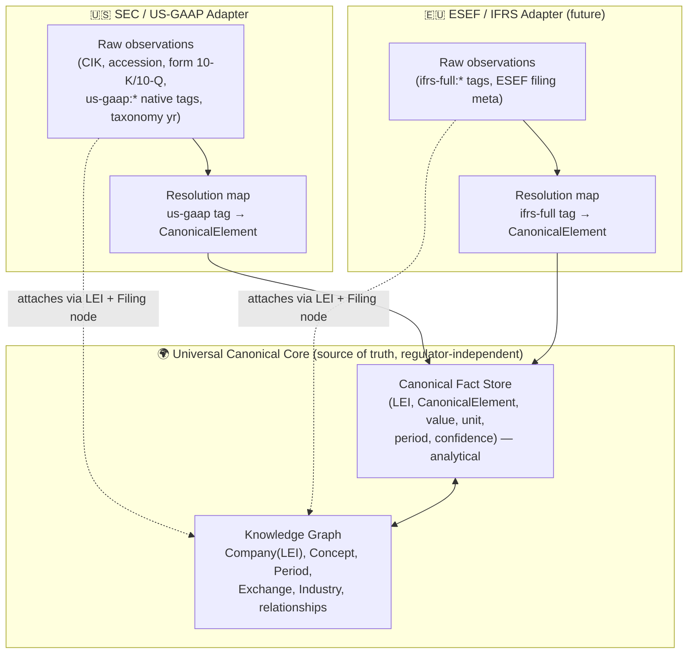
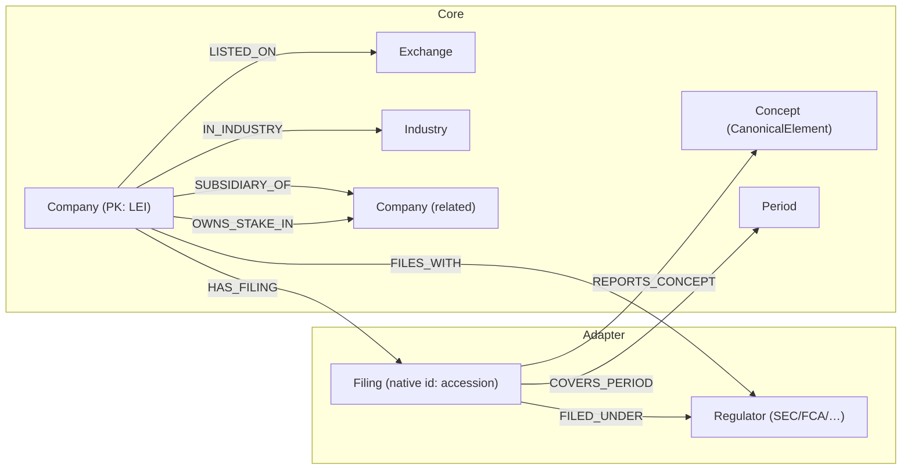
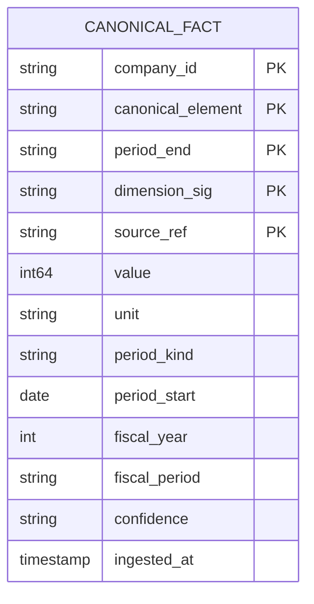
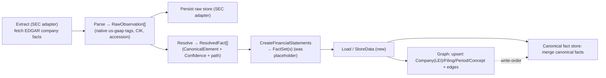

# Universal Company Data Model — Canonical Core + Regulator Adapters

> **SPIKE findings for [STA-130](https://linear.app/state-machine/issue/STA-130/spike-design-hybrid-data-model-graph-knowledge-base-analytical-data).**
> Status: findings complete — logical model settled (§2–§12); physical-deployment choice
> presented as an open team decision (§14). Owner: Damir Catovic. Date: 2026-07-21.

## 1. Context & Guiding Requirements

`arkad` normalizes company financial data and serves screeners, dashboards, and
data-quality checks. This SPIKE decides the **persistence data model**. Three
requirements drive the design:

1. **A universal, regulator- and jurisdiction-independent model** that works for *any*
   company worldwide — not SEC-specific, not US-GAAP-specific. This is the **source of
   truth**.
2. **Regulator-specific data (SEC/EDGAR first, later FCA, BaFin, ESEF/IFRS) connects to
   the universal core and stays independently queryable** — CIK, accession numbers, native
   `us-gaap` tags, and form types are first-class *within their adapter*, joinable to the
   universal model but never leaking into it.
3. **Accounting correctness** — normalization obeys SFAC-6 element definitions and the five
   accounting identities; every normalized fact is traceable back to the raw filing tag it
   came from.

### 1.1 The current codebase is an immature seed, not the target

The design below is a **redesign**, not a preservation of what exists. Today the workspace
has two parallel, non-integrated models and no persistence:

- `sec` crate (live): `CompanyData → HashMap<&ConceptDefinition, CompanyFact> → Vec<Observation>`,
  identity is **`Cik`-centric** (SEC-specific), concept resolution is string-alias matching.
- `xbrl` crate (dormant, not referenced by the pipeline): `CanonicalElement` (42 SFAC-6-rooted
  variants), `ResolvedFact` (with a `Confidence` ladder + `resolution_path`), `FactSet`,
  `Invariant` validation, and a graph-engine **TODO stub**.
- Pipeline runs **Extract → Transform** only. `CreateFinancialStatements` emits a placeholder
  unit struct; the entire **Load SuperState is an empty file**.

What to carry forward vs. change (detail in §10):

| Existing artifact | Verdict |
| --- | --- |
| `xbrl::CanonicalElement` (SFAC-6 vocabulary) | **Keep & promote** — this *is* the universal concept layer, but decouple it from the `us_gaap` module so it is standard-neutral |
| `xbrl::ResolvedFact` + `Confidence` + `resolution_path` | **Keep & promote** — becomes the universal `CanonicalFact`, minus SEC specifics |
| `xbrl::Invariant` (SFAC-6 identities) | **Keep** — universal validation |
| `us_gaap::mappings` (tag → CanonicalElement) | **Reframe** — this is *one adapter* (SEC/US-GAAP), not the core |
| `sec::Cik`-centric identity, `FilingSource` (accession/form) | **Demote** — SEC-adapter-specific; core keys on **LEI** |
| `sec::CompanyData/CompanyFact/Observation` | **Replace** — superseded by the canonical model |

## 2. Architectural Spine — Universal Core + Regulator Adapters (Hub & Spoke)

**Principle:** an adapter's job is to (a) retain the regulator's raw data verbatim and
queryable, and (b) *resolve* native taxonomy tags into the universal `CanonicalElement`
vocabulary, writing normalized facts into the core. The core never contains a `us-gaap`
string, a CIK, or a 10-K form code. A company that files nowhere still exists in the core
(identity + relationships); a company that files with three regulators has three adapters'
worth of raw data all resolving into **one** canonical fact history.

**What resolves vs. what stays in the adapter:** only observations that resolve to a
`CanonicalElement` (at a known `Confidence`) are promoted to the core. Anything regulator-
specific that has no canonical meaning (e.g. a bespoke `us-gaap` disclosure tag with no
SFAC-6 mapping) **remains in the adapter, fully queryable**, but is not forced into the
universal model. This is precisely the "connect to and query regulator-specific data"
requirement.

## 3. Universal Canonical Concept Model

The universal vocabulary is the **SFAC-6-rooted `CanonicalElement`** set (13 Level-1 roots +
~29 Level-2 sub-elements; already enumerated in `xbrl/src/core/elements.rs`). SFAC-6 is a
US document, but its ten elements are **definitional, not standard-specific** — IFRS's
Conceptual Framework defines assets, liabilities, equity, income, and expenses in
substantially the same terms. So the roots are a legitimate *cross-standard* canonical
layer; US-GAAP and IFRS are two **dialects** that resolve into it.

### 3.1 Standard-neutrality — how divergences are handled

- **Roots always map.** Assets/Liabilities/Equity/Revenue/Expenses/Gains/Losses/
  NetIncome/OCI/ComprehensiveIncome/{Operating,Investing,Financing}CashFlow hold under both
  US GAAP and IFRS.
- **Level-2 sub-elements may diverge** (e.g. IFRS bars LIFO inventory; development costs may
  be capitalized under IFRS but expensed under US GAAP; statement groupings differ). Rule:
  where a dialect concept has no faithful canonical sub-element, it is **not** force-fitted —
  it stays a raw adapter observation (queryable) and, if material, motivates a new
  `CanonicalElement` variant added deliberately (via the accounting checklist), never an
  overload of an existing one.
- **Invariant:** never map two different concepts to the same `CanonicalElement` for the
  same period/dimension.

### 3.2 Universal validation (SFAC-6 identities)

The core enforces the five identities as data-quality checks (`xbrl::Invariant`):

1. Assets = Liabilities + Equity
2. Net Income = Revenue − Expenses + Gains − Losses
3. Comprehensive Income = Net Income + OCI
4. ΔEquity = Comprehensive Income + Investments − Distributions
5. Operating CF + Investing CF + Financing CF ≈ ΔCash

Identity #1 failing is always a system bug, never valid company data. Balance-sheet
elements are **Instant**; flow elements are **Duration** — this classification is intrinsic
to the `CanonicalElement`, not to any regulator.

### 3.3 Resolution & confidence (the adapter mechanism, made universal)

Each adapter resolves a raw tag → `CanonicalElement` via the 4-tier ladder, tagging the
resulting fact with its `Confidence`:

| Tier | Confidence | Mechanism |
| --- | --- | --- |
| 1 | `Exact` | direct canonical concept match |
| 2 | `Synonym` | alias list (dialect-specific, e.g. `Revenues`, `SalesRevenueNet`) |
| 3 | `Derived` | SFAC-6 identity / calculation-linkbase children (`parent = Σ childᵢ·weightᵢ`) |
| 4 | `Computed` | full taxonomy linkbase graph traversal |

`resolution_path` records the trace (which tag(s), which derivation) so any canonical fact
is explainable back to the regulator dialect it came from.

### 3.4 Dimensions

XBRL facts can be dimensionally qualified (segment, geography, product). The canonical fact
grain therefore includes an optional **dimension signature** (a set of
axis→member pairs). The unqualified (consolidated total) fact has an empty signature.
Dimensional members are themselves adapter-specific vocabularies that may later gain
canonical mappings; the core stores the signature so screeners can request totals or a
specific segment without the adapter.

## 4. Universal Identity

- **Primary key: LEI** (ISO 17442, 20-char, GLEIF-issued) — global and regulator-agnostic.
- A validated `Lei` newtype is added under `shared/` (sibling to the existing `Cik`), built
  with the `domain-concept` pattern (format + ISO 17442 check-digit validation).
- **CIK is not core.** It is an SEC-adapter identifier. The mapping CIK↔LEI is how the SEC
  adapter attaches its data to the universal company (§11).
- **Fallback identity.** Not every entity has an LEI. `CompanyId = Lei(..) | Cik(..) | …`
  with LEI strongly preferred; a company first seen via SEC with no LEI is keyed on CIK and
  **relinked to LEI later without rewriting facts** (facts key on the resolved `CompanyId`,
  and the graph node carries all known identifiers as properties).

## 5. Universal Knowledge Graph (Knowledge-Base Layer)

Models **identity, structure, and relationships** for every company worldwide — regulator-
agnostic core nodes, with regulator-specific `Filing` nodes attaching via the adapter.

### 5.1 Nodes

| Node | Layer | Key | Notes |
| --- | --- | --- | --- |
| `Company` | core | `lei` (or fallback `CompanyId`) | entity_name, country, status; carries `cik`, other ids as properties |
| `Concept` | core | `CanonicalElement` | the canonical vocabulary as nodes (enables "which concepts expected/missing") |
| `Period` | core | `(kind, key)` e.g. `FY2024`, `Q3-2024` | Instant/Duration |
| `Exchange` | core | `mic` (ISO 10383) | |
| `Industry`/`Sector` | core | `scheme+code` (GICS/SIC/NACE) | |
| `Regulator`/`DataSource` | adapter-bridge | `code` (SEC, FCA, BaFin, ESMA) | |
| `Filing` | adapter | `regulator + native_id` (SEC: accession) | form, filed_date, period_end, taxonomy version |

### 5.2 Edges

| Edge | From → To | Properties |
| --- | --- | --- |
| `HAS_FILING` | Company → Filing | (Filing is adapter-owned but hangs off the core company) |
| `FILED_UNDER` | Filing → Regulator | |
| `FILES_WITH` | Company → Regulator | first_filed |
| `COVERS_PERIOD` | Filing → Period | |
| `REPORTS_CONCEPT` | Filing → Concept | resolved confidence (structural completeness) |
| `LISTED_ON` | Company → Exchange | ticker, listing_date |
| `IN_INDUSTRY` | Company → Industry | scheme |
| `SUBSIDIARY_OF` | Company → Company | since |
| `OWNS_STAKE_IN` | Company → Company | percentage |

### 5.3 Diagram

### 5.4 Data-quality traversals (why a graph)

The graph is a **completeness engine** — expected structure is modeled, so gaps are
absences in a traversal rather than SQL NULL-hunting:

- _"Which companies are missing a Q3-2024 quarterly report?"_ — for each `Company
  -FILES_WITH-> R`, check for a `Filing -COVERS_PERIOD-> Q3-2024` of the right form.
- _"Does FY2024 have all four quarters?"_ — count `Filing -COVERS_PERIOD-> {Q1..Q4 2024}`.
- _"Which required concepts did this filing fail to report?"_ — the set difference between
  expected `Concept`s and the filing's `REPORTS_CONCEPT` edges.

## 6. Universal Canonical Fact Store (Analytical Layer)

A columnar fact table — regulator-agnostic — one row per canonical observation. **Grain:**
`(company_id, canonical_element, period, dimension_signature, source_ref)`.

| Column | Type | From | Notes |
| --- | --- | --- | --- |
| `company_id` | string | `CompanyId` (LEI preferred) | partition/cluster key |
| `canonical_element` | enum | `CanonicalElement` | universal concept |
| `value` | int64 | `ResolvedFact.value` | integer minor units (currency) or scaled |
| `unit` | string | `Unit` | ISO 4217 currency, `shares`, `pure`, … |
| `period_kind` | enum | `Period` | Instant / Duration |
| `period_start` | date? | `Period::Duration.start` | null for Instant |
| `period_end` | date | `Period` | Instant.date or Duration.end |
| `fiscal_year` | int | `FiscalYear` | reporting entity's fiscal calendar |
| `fiscal_period` | enum | `FiscalPeriod` | Q1..Q4 / FY |
| `dimension_sig` | string? | dimension signature | null/empty = consolidated total |
| `confidence` | enum | `Confidence` | Exact/Synonym/Derived/Computed |
| `resolution_path` | list<string> | `ResolvedFact.resolution_path` | traceability |
| `source_ref` | string | (generic) | **opaque handle to the adapter filing** (e.g. `sec:accession`) — the only link out to a regulator |
| `ingested_at` | timestamp | (load) | idempotency/audit |

Note what is **absent**: no `cik`, no `form`, no `accession_number` column, no `us-gaap`
tag. Provenance to a specific regulator filing is a single opaque `source_ref` that resolves
into the adapter (§7) — keeping the fact store universal while still fully traceable.

## 7. Regulator Adapter Layer (SEC/EDGAR concrete)

Each adapter owns three things, all **independently queryable** and joinable to the core by
`company_id` + `source_ref`:

1. **Raw observation store** — every native fact as filed, verbatim:
   `cik`, `accession_number`, `form` (10-K/10-Q/8-K/20-F), `filed_date`, `period_end`,
   `taxonomy_version`, `native_tag` (e.g. `us-gaap:RevenueFromContractWithCustomerExcludingAssessedTax`),
   `value`, `unit`, `period`, `dimensions`. This is the replay source and the "SEC-specific
   query" surface.
2. **Resolution map** — dialect tag → `CanonicalElement` with priority-ordered aliases
   (today's `us_gaap/mappings.rs`, reframed as the SEC adapter's map). Drives promotion of
   raw observations into core canonical facts.
3. **Filing metadata → graph** — creates the `Filing` node + `HAS_FILING`/`FILED_UNDER`/
   `COVERS_PERIOD`/`REPORTS_CONCEPT` edges and resolves CIK→LEI to attach to the core company.

### 7.1 Querying in both directions

- **Universal → regulator-specific:** start from any `Company` (worldwide) in the core, fetch
  canonical facts; drill down via `source_ref` to see the exact SEC filing + native
  `us-gaap` tag that produced a number ("what tag did Apple's FY2024 Revenue come from?").
- **Regulator-specific → universal:** start from an SEC concept (`by CIK`, `by form`, `by
  us-gaap tag`) in the adapter, resolve CIK→LEI, and pull the universal normalized history
  ("give me every company that reported `us-gaap:Goodwill`, as canonical `Goodwill`").

## 8. Consistency Model & Layer Hierarchy

- **Graph = source of truth** for identity, relationships, structural metadata, completeness.
- **Canonical fact store = authoritative** for canonical numeric values/time-series.
- **Adapter raw store = the replay source** (system of record for what was actually filed).
- **Write order:** adapter raw ingested → graph nodes/edges upserted → canonical facts
  written. A canonical fact may only reference a `source_ref`/company the graph already knows.
- **Recoverability:** the graph and the canonical fact store are both **rebuildable from the
  adapter raw stores** by replaying resolution. So the raw stores are the durable system of
  record; core layers are materializations that can be dropped and rebuilt (a major
  simplifier for schema evolution and for trusting the normalization).
- **Drift handling:** reconciliation compares graph `Filing`s vs. distinct `source_ref`s in
  the fact store vs. the adapter raw set; the symmetric difference is the drift report.
  Canonical facts with no known filing are quarantined; filings with no canonical facts are a
  completeness gap (surfaced by traversal).

### 8.1 Data-Quality Model (completeness + invariants + confidence)

Data quality is enforced on **two independent axes**, mapping onto the two core tiers:

1. **Structural completeness — graph tier.** Expected structure is modeled, so gaps are
   *absences in a traversal*: missing filings/periods/concepts (§5.4). Store mechanics:
   Postgres → recursive CTE / anti-join; graph DB → a Cypher/traversal pattern that fails to
   match; lakehouse → not its job (completeness stays in the graph tier).
2. **Value-level invariants — canonical fact tier.** The five SFAC-6 identities
   (`xbrl::Invariant`), rollup consistency (`parent ≈ Σ childᵢ·weightᵢ` within a threshold),
   and confidence/traceability. Failure kinds mirror `ValidationErrorKind`:
   `IncompleteData`, `InconsistentIdentity`, `ImpreciseRollup`. Identity #1
   (Assets = Liabilities + Equity) failing is always a system bug, never valid data.

Where checks run: (a) **at load** — post-materialization validation before facts are marked
`published`; (b) **as scheduled audits** — over the whole store; (c) **on drift** — the §8
reconciliation. On failure, facts are **quarantined** (not deleted) and, because the raw
store is the rebuildable SoT, can be recomputed after a resolution/mapping fix. Every fact
carries `confidence` + `resolution_path`, so a data-quality report is explainable down to the
native tag it came from.

Storage mechanics by option: **Postgres** → SQL aggregate checks + CHECK-style assertions +
materialized views for scheduled audits; **graph DB** → completeness natively, invariants
still computed at the fact tier; **Iceberg** → invariant/rollup batch jobs via DataFusion /
DuckDB / any lakehouse engine (see §13a on polyglot access).

## 9. Mapping the Transform Pipeline Onto the Model

Today: `ParseCompanyFacts → CompanyData`; `CreateFinancialStatements → placeholder`; Load absent.

- **Resolution moves earlier and becomes the adapter boundary:** `ParseCompanyFacts` emits
  `RawObservation`s (already implemented in `xbrl::sec_api::company_facts::parse`); a new
  resolve step turns them into `ResolvedFact`s. `CreateFinancialStatements` stops emitting a
  placeholder and emits `FactSet`s (the intermediate representation — no extra DTO needed).
- **Load/`StoreData`** is the dual-writer: raw store (adapter) → graph → canonical facts.
- `sec::CompanyData/Observation/ConceptDefinition` are **retired** in favor of
  `xbrl::FactSet/ResolvedFact/CanonicalElement`; this SPIKE is the trigger for that
  sec→xbrl migration flagged in the ticket's Additional Notes.

## 10. Migration From the Current (Immature) Skeleton

| Step | Action |
| --- | --- |
| 1 | Promote `xbrl::core` (CanonicalElement, ResolvedFact, FactSet, Confidence, Invariant, Period, Unit) to the **standard-neutral core**; decouple `CanonicalElement` from the `us_gaap` module namespace. |
| 2 | Reframe `xbrl::us_gaap` as the **SEC/US-GAAP adapter** (raw parse + resolution map + filing metadata). Keep `sec_api::company_facts::parse`. |
| 3 | Add `Lei` domain concept + `CompanyId` enum under `shared/`; add CIK→LEI translation to the SEC adapter. |
| 4 | Implement the resolution engine (`xbrl::core::graph` TODO stub) — the 4-tier ladder + calc-linkbase derivation. |
| 5 | Wire `CreateFinancialStatements` to emit `FactSet`s; retire `sec::CompanyData`. |
| 6 | Implement the **Load SuperState / `StoreData`** as the dual-writer over the chosen storage tech (§11–12). |

## 11. LEI & CIK↔LEI Translation (SEC-adapter concern)

- **Obtain LEI:** GLEIF public API / bulk "golden copy"; SEC does not key on LEI, so the
  adapter maintains CIK→LEI.
- **Minimal viable → automated:** (1) static hardcoded map now (mirrors the sample CIKs in
  `cik/constants.rs`); (2) batch cross-reference GLEIF golden-copy × SEC ticker/CIK map;
  (3) on-demand GLEIF API lookup at ingest with cache. Ambiguous/missing → key on CIK,
  flag for review, backfill LEI later without rewriting facts.

## 12. Batch vs. Incremental

Both modes idempotent, raw→graph→canonical ordered:

- **Batch (backfill):** for a company set, ingest all historical filings into the adapter
  raw store, then materialize graph + canonical facts. Dedupe on natural key
  `(company_id, canonical_element, period_end, dimension_sig, source_ref)`.
- **Incremental:** triggered by a newly detected filing (SEC EDGAR `submissions`/RSS feed;
  polling first, push later). Adapter ingests the new filing; graph gains the `Filing` node
  + edges (flipping any completeness gap to satisfied); canonical facts merge.
- **Restatements/amendments:** a new accession → new raw + canonical rows; prior rows retained
  for audit; "latest" resolved by `filed_date` (amendment supersedes original — a domain
  invariant from the accounting skill).

## 12a. Design Principle — Language-Agnostic Data Layer

The ingestion/normalization **application** is Rust, but the **persisted data must not be
Rust-locked**. The maturity risks surfaced in §13 are really *Rust-binding* risks (pre-1.0
crates, an embedded engine tied to the Rust process). They are avoided by choosing **open
formats and standard wire protocols** for the data layer, so the data is readable by many
engines and languages — and outlives any single binding:

- **Open table format (Iceberg / Parquet)** — data in object storage, readable by Rust,
  Python (PyIceberg), DuckDB, DataFusion, Spark, Trino, Snowflake, BI tools. The Rust crate
  being pre-1.0 does not lock the data in; a screener frontend, a Python notebook, or a future
  service can read the same tables directly.
- **Standard SQL wire protocol (Postgres)** — drivers in every language; the store is not
  hostage to one library's maturity.
- **Avoid embedded Rust-only engines** for the SoT (e.g. an in-process graph tied to the Rust
  binary) — they are language- and process-locked.

Consequence: the **canonical fact store's intended destination is an Iceberg lakehouse**
(open, polyglot, columnar), with Postgres as the low-burden on-ramp; the raw stores and any
graph tier should likewise favor polyglot-accessible stores over Rust-embedded ones.

## 13. Storage Technology Decision

The **logical** model (§2–§12) is storage-independent. This section chooses the **physical**
store(s). Findings below are from a mid-2026 primary-source review (crates.io, GitHub,
official license pages; 25 claims adversarially verified, 0 refuted). All version/maintenance
figures are point-in-time (mid-2026) and drift quickly.

### 13.1 Graph database candidates

| Option | Rust driver | Query lang | License | Deploy | Verdict |
| --- | --- | --- | --- | --- | --- |
| **Neo4j** | `neo4rs` — **community/labs** (neo4j-labs), pre-1.0 (0.9.0-rc.10), async | Cypher | Apache-2.0/MIT (driver) | server | Mature engine, but Rust driver unofficial + feature-incomplete |
| **Memgraph** | `rsmgclient` — official but **non-async C wrapper** (mgclient), C build deps | Cypher | Apache-2.0 (client) / **BSL** (server) | server (in-mem) | Weak Rust story (no async) |
| **TypeDB** | under-evidenced | TypeQL (steep) | — | server | Insufficient primary-source signal; not recommended without more research |
| **SurrealDB** | `surrealdb` — **official**, actively released (v3.2.1) | SurrealQL | **BSL 1.1** engine (DBaaS restriction; 4-yr→Apache) | embedded/server | Best Rust support; multi-model; but BSL + documented 3.0-beta query-planner regressions (since fixed, PR #7018) |
| **KùzuDB** | `kuzu` (v0.11.3) | Cypher | **MIT** | **embedded** (columnar+vectorized) | Architecturally ideal, **but repo archived Oct 2025 (Apple acquisition)** — abandoned upstream; forks unproven. Disqualified day-one |

### 13.2 Analytical store candidates

| Option | Rust support | License | Fit | Verdict |
| --- | --- | --- | --- | --- |
| **Apache Iceberg** | official `iceberg` crate, active (~1–2 mo cadence), **pre-1.0/unstable API** | Apache-2.0 | lakehouse: schema evolution, time-travel, partitioning | Right for scale-out prod; API not yet stable; heavier ops |
| **PostgreSQL** | mature (`sqlx`, `tokio-postgres`) | permissive | JSONB (semi-structured), recursive CTEs (graph-style traversal), relational facts | **Lowest operational burden**; single system for OLTP + adapter raw + graph-lite |
| **DuckDB** | `duckdb` crate; **`pg_duckdb` (MIT)** embeds it *in* Postgres | MIT | embedded columnar OLAP, Parquet-native | Excellent dev/local + in-Postgres OLAP without Parquet export |

### 13.3 Multi-model / single-store consolidation

- **SurrealDB** — genuine multi-model, but BSL + query-planner-risk signals argue against
  betting the core on it now.
- **Postgres + Apache AGE** (graph extension) — **under-evidenced**; no primary source found
  evaluating it for this workload. Recursive CTEs are the better-evidenced Postgres graph path.
- **Embedded Kùzu + DuckDB** — the most architecturally elegant "graph + analytics, both
  embedded" pairing, but Kùzu's archival removes it as a day-one dependency.

### 13.4 The core trade-off (evidence)

At **low-millions-of-rows** scale for a **small Rust team**, a day-one two-store hybrid's
**dual-write + cross-store reconciliation** cost is not yet justified (cross-store reads are
never a consistent snapshot; every store adds ops surface). No Rust graph driver is
simultaneously official, mature, and permissively licensed. Therefore the *physical* split
should be **deferred and migration-gated**, even though the *logical* hybrid is correct.

**Caveats (from the research):** no independent benchmark compares these engines on this
workload — fit is architectural inference, not measured. SurrealDB perf figures come from a
single reporter's pre-GA beta (since fixed). Kùzu forks' viability is unproven. Postgres+AGE
is under-researched. BSL "Database Service" scope for a specific SaaS model is a legal
question for counsel.

## 14. Architecture Options — Physical Deployment (open decision)

The **logical** model (§2–§12) is settled and storage-independent. The **physical**
deployment is an open team decision. Both options below implement the *same* three-tier
logical hybrid; they differ only in whether the tiers live in one store or several from
day one. Presented without a single verdict — the trade-offs are laid out for team
discussion.

### 14.A Option A — Postgres-centric, migration-gated split

One PostgreSQL instance implements all three logical tiers initially:

- **Adapter raw store** — table per regulator (or JSONB): verbatim observations (CIK,
  accession, native `us-gaap` tag, taxonomy version). Durable **system of record**.
- **Canonical fact store** — normalized `canonical_fact` table (§6 grain); add **`pg_duckdb`
  (MIT)** for in-process columnar OLAP when screener scans warrant it (no Parquet export).
- **Knowledge graph** — nodes/edges as relational tables; completeness traversals (§5.4)
  via **recursive CTEs**.

Then split a tier out to a specialist store **only when a measured trigger appears**:

| Trigger (measured) | Action |
| --- | --- |
| CTE completeness/relationship traversals become a latency bottleneck, or ownership queries grow multi-hop-heavy | Move the KB tier to a dedicated graph DB; re-evaluate Rust drivers then |
| Fact volume outgrows single-node Postgres, or lakehouse features needed (time-travel, columnar scan over 10⁸⁺ rows) | Move canonical facts to an **Iceberg** lakehouse (re-check the `iceberg` crate is ≥1.0) |
| Multi-region / heavy concurrent ingest | Reconsider store topology holistically |

| Pros | Cons |
| --- | --- |
| Lowest operational burden (one store, one backup/migration story) | Recursive-CTE graph queries are more verbose than Cypher/SurrealQL |
| Dual-write is a **non-issue** — the tiers share one transaction | Defers building real graph-DB/lakehouse expertise |
| Permissive licensing end-to-end (PostgreSQL/MIT) | May need a migration later (mitigated: raw store is rebuildable, §8) |
| Mature async Rust drivers (`sqlx`, `tokio-postgres`) | Single-node scaling ceiling eventually |
| Split is cheap/reversible — replay resolution from the raw SoT | |

### 14.B Option B — Day-one physical hybrid (separate stores)

Stand up distinct stores per tier immediately: a **graph DB** for the KB + an **analytical
store** for canonical facts (+ raw in either). Concrete pairings, with the research caveats:

- **SurrealDB (graph/multi-model) + Postgres/DuckDB (facts)** — only *officially maintained*
  async Rust graph SDK; but engine is **BSL 1.1** (DBaaS restriction; legal review advised)
  and showed 3.0-beta query-planner regressions (since fixed).
- **Neo4j (graph) + Postgres/DuckDB (facts)** — most mature graph *engine* + Cypher, but the
  Rust driver `neo4rs` is **community/labs, pre-1.0, feature-incomplete**.
- **Memgraph (graph) + …** — fast in-memory + Cypher, but Rust client is a **non-async C
  wrapper** and the server is BSL.
- (KùzuDB, the ideal embedded graph, is **excluded** — repo archived Oct 2025.)

| Pros | Cons |
| --- | --- |
| Purpose-built graph traversals (Cypher/SurrealQL) from day one | **Dual-write + cross-store reconciliation** cost immediately (§8); cross-store reads aren't a consistent snapshot |
| No later migration for the graph tier | No Rust graph driver is simultaneously official + mature + permissively licensed |
| Builds graph-DB operational expertise early | Higher ops surface (≥2 systems, 2 backup/consistency stories) for a small team |
| Clean physical separation of concerns | Licensing nuance (BSL) or maturity risk (neo4rs) depending on pick |

### 14.C Decision criteria & neutral framing

Weigh against: Rust driver maturity, licensing safety (AGPL/BSL/SSPL), operational burden,
fit at low-millions-growing scale, embedded local-dev story, query ergonomics. At the stated
**current** scale (thousands of companies, low-millions of facts), Option A minimizes burden
and risk; Option B pays complexity now to avoid a future migration and to gain native graph
ergonomics. Because the raw stores are the rebuildable system of record (§8), **the physical
choice is reversible either way** — so this can be revisited without endangering the source
of truth. The team should pick based on appetite for operational surface vs. desire for
native graph tooling up front.

### 14.D Implementation order (identical under both options)

1. Build **canonical core types** (`CanonicalElement`, `CanonicalFact`/`ResolvedFact`,
   `FactSet`, `Lei`/`CompanyId`, `Invariant`) — storage-agnostic domain layer.
2. Build the **SEC adapter** (raw parse + resolution map + CIK→LEI).
3. Implement **Load/`StoreData`** behind a storage-abstraction trait so Option A or B (or a
   later split) is a matter of swapping the writer implementation, not rewriting the pipeline.
4. Persist raw first (system of record), then materialize graph + canonical facts.

> **Note:** under either option, an **Iceberg lakehouse is the expected long-term home for
> the canonical fact store** (§12a) — open, polyglot, columnar. Option A simply reaches it via
> a migration trigger; a team that wants it from the start can adopt Iceberg for facts on day
> one while keeping the graph tier in Postgres (a partial Option B). Gate on the `iceberg`
> crate reaching ≥1.0, or write facts via a non-Rust path (PyIceberg/DataFusion) if needed
> sooner.

### 14.E Migration approach (why a later split is low-risk)

Migration between physical options is a **replay, not a data migration of the source of
truth** — the design isolates the risk:

1. The **adapter raw stores are the rebuildable SoT**; graph + canonical facts are
   materializations.
2. To move a tier (e.g. canonical facts Postgres → Iceberg): implement the new writer behind
   the storage trait; **backfill by replaying** raw → resolve → write into the new store.
3. **Verify parity:** row counts, all SFAC-6 invariant checks, and the §8 drift reconciliation
   (which doubles as migration verification) between old and new stores.
4. Optionally **dual-write** during a transition window, then cut reads over and decommission
   the old tier.

Effort is proportional to writing one new writer + a backfill job, not to a risky migration of
the system of record. The storage-abstraction trait (§14.D.3) keeps the pipeline untouched.

## 15. Open Questions / Risks

- **Cross-standard concept coverage:** the Level-2 canonical set is US-GAAP-shaped; IFRS
  onboarding will surface concepts needing deliberate new `CanonicalElement` variants.
- **Dimensional explosion:** segment/geography dimensions multiply fact rows; the
  `dimension_sig` grain must be indexed carefully.
- **LEI coverage** for smaller/foreign filers — CIK fallback must be first-class.
- **Dual-write consistency** without distributed transactions — mitigated by raw stores as
  replay source + graph-first ordering; reconciliation cadence needs tuning.
- **Single-store vs hybrid** — resolved in §13/§14 from research, with the raw-store-as-SoT
  design keeping the storage choice reversible.
