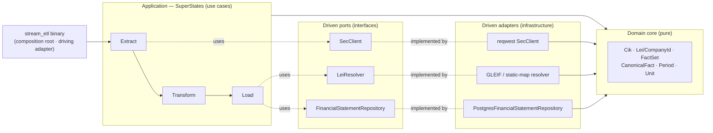
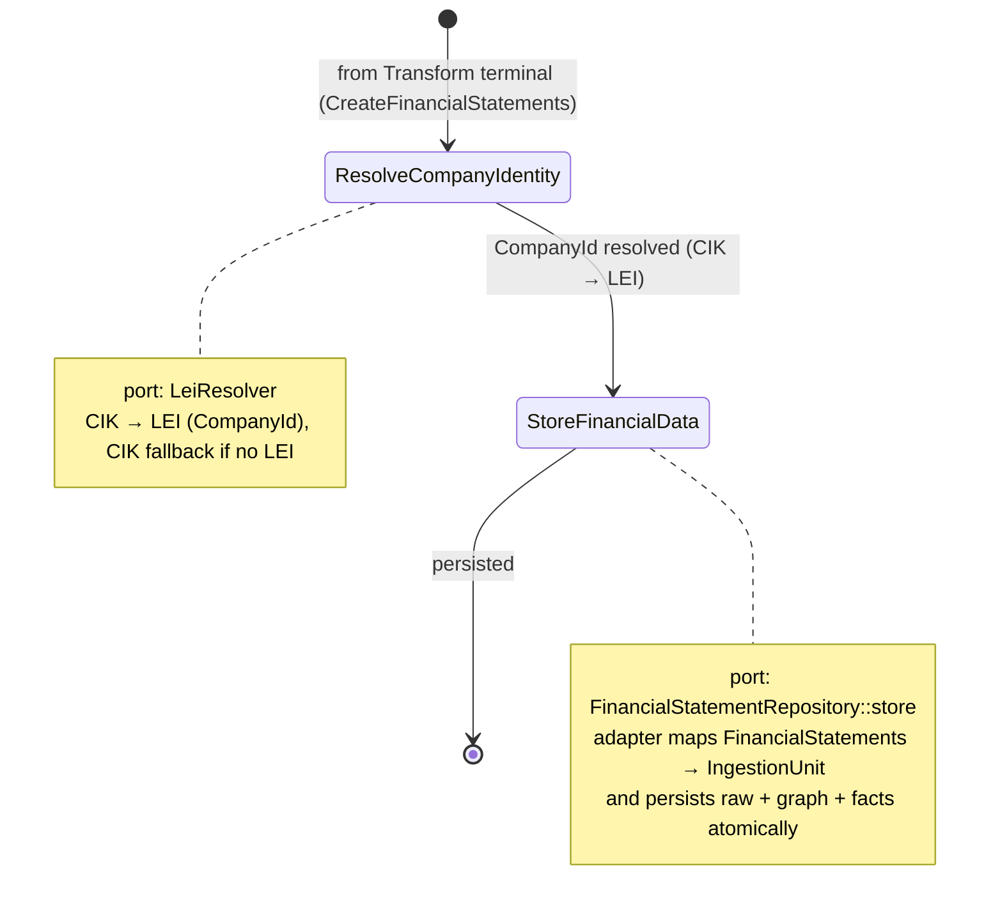
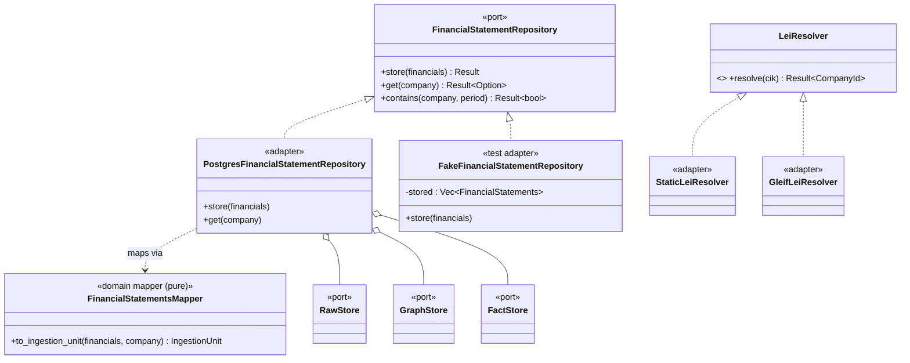
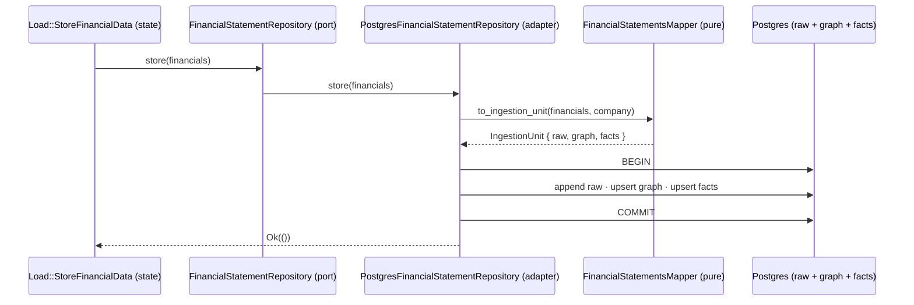

# Load `SuperState` — Hexagonal Design (WORKING DRAFT)

> **Status:** exploratory design for the Load phase, drafted as a follow-on to STA-130 / the
> storage-abstraction work (`storage_traits_design.md`). **Non-normative** — for review and
> iteration before cutting Load tickets. Uses the real framework abstractions (`State`,
> `SuperState`, `Transition`) and the storage ports already designed.
>
> **Premise (the framing we agreed on):** arkad already *is* a hexagonal / ports-and-adapters
> architecture — this doc just makes the Load side explicit and symmetric with the Extract side.

---

## 1. arkad as a hexagon

The pieces already map cleanly onto ports-and-adapters; nothing new is being invented, only named.

- **Domain core (innermost, pure, persistence- and I/O-ignorant):** the value objects and domain
  concepts — `Cik`, `Lei`/`CompanyId`, `EntityName`, `CanonicalFact`, `FactSet`, `Period`, `Unit`,
  `FiscalYear`, `ConceptDefinition`. No `async`, no SQL, no HTTP.
- **Application layer (use cases):** the `SuperState`s and their sub-`State`s — `Extract`,
  `Transform`, `Load`. They orchestrate the flow and depend **only on port traits**.
- **Driven ports (interfaces the application needs):** `SecClient` (extract side, already exists),
  and on the load side `FinancialStatementRepository` + `LeiResolver` (this doc).
- **Driven adapters (infrastructure):** `SecClient`-over-`reqwest`, `PostgresFinancialStatementRepository`,
  a GLEIF/static-map resolver, plus in-memory fakes for tests.
- **Driving adapter / composition root:** the `stream_etl` binary — it constructs the concrete
  adapters and injects them, then starts the machine.

**The dependency rule holds by construction:** states depend on port traits; adapters depend inward
on domain types; only the binary names a concrete backend. This is the same inversion the codebase
already does with `SecClient` injected into a state's context — Load just adds a second port.



**Symmetry with Extract.** Extract's outermost concern is an *inbound* port (`SecClient`: pull bytes
from the SEC). Load's outermost concern is an *outbound* port (`FinancialStatementRepository`: push
canonical data into the sink). Same shape, opposite direction — the pipeline is bytes-in →
domain-in-the-middle → facts-out.

---

## 2. The Load `SuperState`

**Purpose:** take the Transform output for one company and persist it into the data sink, keyed on
the universal identity (LEI), idempotently.

**Position in the pipeline.** Transform terminates at `CreateFinancialStatements` (today a
placeholder output). The established cross-`SuperState` pattern — the terminal state of one
`SuperState` transitions into the first state of the next (as `ExecuteSecRequest → ParseCompanyFacts`
moves Extract→Transform) — carries us in: `CreateFinancialStatements → <first Load state>`.

**Input "in a separate format".** What arrives is application-domain shaped — a `FinancialStatements`
value (the concrete type that replaces `CreateFinancialStatementsOutput`; the "retire `CompanyData`"
work). Load's job is to turn that into the **storage-domain** shape and persist it. Where that
mapping lives is the one real design decision — see §6.

### Sub-states

Two states, kept thin (recommended shape — mapping pushed into the adapter, see §6):



| Sub-`State` | Input | Port used | Output |
| --- | --- | --- | --- |
| `ResolveCompanyIdentity` | `Cik` + `FinancialStatements` | `LeiResolver` | `CompanyId` + `FinancialStatements` |
| `StoreFinancialData` (terminal) | `CompanyId` + `FinancialStatements` | `FinancialStatementRepository` | persistence receipt / `()` |

An optional third state, `ReconcilePersistence` (post-write SFAC-6 invariant + completeness check),
is deferred — it only pays once there is something to reconcile against.

**Context (dependency injection).** Exactly like `ExtractSuperStateContext { sec_client: SecClient }`,
the Load context carries the injected concrete ports:

```rust
pub struct LoadSuperStateContext<R, L> {   // R: FinancialStatementRepository, L: LeiResolver
    repository: R,
    lei_resolver: L,
}
```

(Concrete generic types, not `dyn` — consistent with the non-object-safe `State` trait; §
`storage_traits_design.md`.)

---

## 3. The ports Load needs

### 3.1 `FinancialStatementRepository` (the load-side outbound port)

The port the Load state actually talks to. It speaks the **application** domain (financial
statements), *not* rows or the storage-tier bundle — that keeps the state thin and the mapping
behind the boundary.

```rust
/// Outbound port: persist a company's canonical financial statements into the data sink,
/// and read them back. Domain types only — no SQL/Cypher, no IngestionUnit leaking out.
#[async_trait]
pub trait FinancialStatementRepository: Send + Sync
where
    StorageError: From<Self::Error>,
{
    type Error;

    /// Persist one company's statements as a unit (idempotent by (company, period, source)).
    async fn store(&self, financials: &FinancialStatements) -> Result<(), Self::Error>;

    /// Read back — for verification, idempotency checks, and the eventual screener/API.
    async fn get(&self, company: &CompanyId) -> Result<Option<FinancialStatements>, Self::Error>;

    /// Cheap idempotency probe used by the pipeline before re-storing.
    async fn contains(&self, company: &CompanyId, period: FiscalYear) -> Result<bool, Self::Error>;
}
```

*(Method names illustrative — `store`/`get`/`contains` are the write / read / exists trio; the
inventory stays provisional per `storage_traits_design.md`.)*

**Relationship to `storage_traits_design.md`.** `FinancialStatementRepository` is the *Load-facing*
port. Its concrete adapter is where the storage `Repository` facade and the tier stores
(`RawStore`/`GraphStore`/`FactStore` + `ingest`) live — they become the **implementation** of
`store`, not something the Load state sees. Two honest ways to line these up, see §6.

### 3.2 `LeiResolver` (identity port)

```rust
/// Outbound port: resolve a regulator identifier to the universal CompanyId (LEI preferred).
#[async_trait]
pub trait LeiResolver: Send + Sync {
    type Error;
    async fn resolve(&self, cik: &Cik) -> Result<CompanyId, Self::Error>; // CIK fallback inside CompanyId
}
```

Adapters: `StaticLeiResolver` (hardcoded top-N map — the SPIKE's MVP), `GleifLeiResolver`
(GLEIF API, later), `FakeLeiResolver` (tests). Same port, swappable — exactly the point.

---

## 4. Adapters & the class picture



The `PostgresFinancialStatementRepository` **composes** the three tier stores (raw/graph/facts) and
uses a pure **`FinancialStatementsMapper`** (Data Mapper) to turn the application-domain
`FinancialStatements` into the storage-domain `IngestionUnit` — then persists all three tiers in one
transaction (Unit of Work). The Load state sees none of this.

### 4.1 Connection pooling & sharing

The repository's low-level "client" is a **connection pool** (`sqlx::PgPool`) — the exact analog of
`reqwest::Client` inside `SecClient`. It is:

- **Sealed inside the adapter**, never in the state context. The context holds the *port*
  (the repository); the pool is an infrastructure detail. (This is why the DB "client" doesn't
  appear in the context — the repository hides it.)
- **Built once at the composition root** (`main`) and **shared** — `PgPool` is `Arc`-backed, so
  clones share the same underlying pool, exactly as `reqwest::Client` clones share one connection
  pool. Inject it (DI) rather than a process-global `OnceLock`: unlike `SecClient`'s rate limiter
  (a genuine process-wide invariant that *is* a global), the pool is config-dependent (URL,
  `max_connections`) and cleaner constructed-and-injected at the root.

| | Extract (`SecClient`) | Load (repository) |
| --- | --- | --- |
| Low-level client | `reqwest::Client` (shared conn pool) | `sqlx::PgPool` (shared conn pool) |
| Built | once, at the root | once, at the root |
| Shared via | `Arc`-backed clone | `Arc`-backed clone |
| Also shared | rate limiter (process-global) | the pool bounds total DB connections |

**Why sharing is a *correctness* requirement, not just efficiency.** The atomic multi-tier `ingest`
(the strong contract — raw + graph + facts in one transaction) works *only* because the three tiers
draw from the **same** pool: a transaction cannot span two pools. So a co-located
`PostgresFinancialStatementRepository` holds one `PgPool`, and `ingest` does one `pool.begin()` over
all three writes. Separate pools per tier ⇒ no cross-tier transaction ⇒ the weak contract by
construction. (Mirror of Extract: the *shared* rate limiter is what guarantees the SEC rate ceiling
across all clients — sharing buys correctness there too.) A single bounded pool also caps total DB
connections across all the concurrently-running company pipelines.

---

## 5. The store flow (how "data in a separate format" gets persisted)



- **In:** application-domain `FinancialStatements` (a separate, source-shaped format).
- **Boundary:** the port (`store`) — the state stops here.
- **Mapping:** a pure domain mapper (testable with zero DB).
- **Out:** one atomic multi-tier write; raw is the durable SoT (`storage_traits_design.md` §ingest
  contract).

---

## 6. The one real decision — where does the mapping live?

`FinancialStatements` (application shape) must become `IngestionUnit` (storage shape). Two honest
placements:

- **(A) In the adapter (recommended).** The port is `FinancialStatementRepository::store(financials)`;
  the adapter calls a pure `FinancialStatementsMapper` internally. **Pros:** Load stays two thin
  states; the storage-tier complexity (`IngestionUnit`, raw/graph/facts) never leaks into the
  application; the port speaks the domain a reviewer expects. **Cons:** the mapper is "infrastructure"
  even though it's pure domain logic (mitigated by keeping it a standalone, unit-tested function).
- **(B) In a Load sub-state.** Add `BuildIngestionUnit` between resolve and store; the port becomes
  the lower-level `Repository::ingest(IngestionUnit)` from `storage_traits_design.md`. **Pros:** the
  mapping is a visible, independently-testable application step. **Cons:** three states; the
  application now handles the storage-tier bundle, coupling it to the storage decomposition.

**Recommendation: (A).** It's the cleaner hexagon — the port speaks financial statements, mapping is
a pure function invoked at the boundary, and the raw/graph/facts split stays an implementation
detail of the adapter. (B) is a reasonable fallback if we want the mapping surfaced as a pipeline
stage. Either way the mapper itself is a pure, DB-free, unit-tested domain function.

This also reconciles the two "repository" names: **`FinancialStatementRepository`** is the Load port;
the **`Repository`/tier-store** design from `storage_traits_design.md` is the adapter's internals.

---

## 7. Open questions / next steps

- **Concrete `FinancialStatements` type.** Load's whole contract depends on the concretization of the
  current placeholder `CreateFinancialStatementsOutput` — this is the "retire `CompanyData`" work and
  should be pinned first (it's the port's vocabulary).
- **Idempotency key.** `(CompanyId, FiscalYear, source_ref)` is the assumed unit; `contains` probes
  it. Confirm against the §6 fact grain.
- **Resolve-or-defer identity.** Should `ResolveCompanyIdentity` block the write when no LEI exists,
  or persist under the CIK fallback and backfill the LEI later? (SPIKE says CIK fallback is
  first-class → lean: persist with fallback, never block ingest on GLEIF availability.)
- **Where reconciliation lives.** `ReconcilePersistence` as a Load sub-state vs a separate scheduled
  job. Deferred.
- **Ticket slicing.** Natural order: (1) concrete `FinancialStatements` type; (2) `LeiResolver` port
  + static adapter; (3) `FinancialStatementRepository` port + fake + the mapper; (4) `Load`
  `SuperState` wiring the two states; (5) `PostgresFinancialStatementRepository`. Each small and
  reviewable, all descending from STA-130 (see the roadmap comment there).

---

*Companion docs: `storage_traits_design.md` (the storage ports this builds on),
`design_patterns_primer.md` (the pattern vocabulary), `hybrid_data_model.md` (the data model).*
