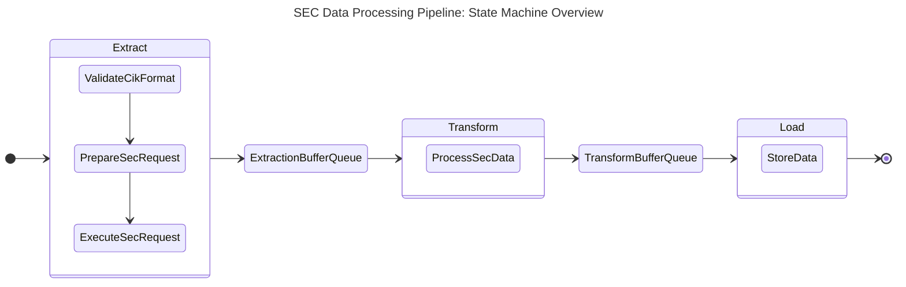

```mermaid
---
title: "SEC Data Processing Pipeline: State Machine Overview"
---
stateDiagram-v2
    direction LR

    [*] --> Extract
    state Extract {
        ValidateCikFormat --> PrepareSecRequest
        PrepareSecRequest --> ExecuteSecRequest
    }

    Extract --> ExtractionBufferQueue
    ExtractionBufferQueue --> Transform

    state Transform {
        ProcessSecData
    }

    Transform --> TransformBufferQueue
    TransformBufferQueue --> Load

    state Load {
        StoreData
    }

    Load --> [*]
```