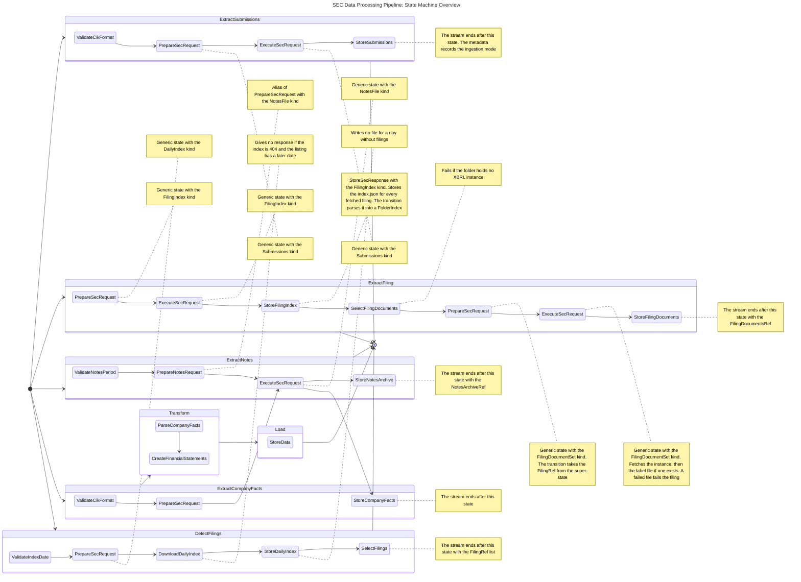

```mermaid
---
title: "SEC Data Processing Pipeline: State Machine Overview"
---
stateDiagram-v2
    %% Align all the SuperStates from left-to-right
    direction LR

    %% `ExtractCompanyFacts` SuperState
    [*] --> ExtractCompanyFacts
    state ExtractCompanyFacts {
        ValidateCikFormat --> PrepareSecRequest
        PrepareSecRequest --> ExecuteSecRequest
        ExecuteSecRequest --> StoreCompanyFacts
        note right of StoreCompanyFacts : The stream ends after this state
    }

    ExtractCompanyFacts --> Transform

    %% `ExtractNotes` SuperState, one per Notes file
    [*] --> ExtractNotes
    state ExtractNotes {
        ValidateNotesPeriod --> PrepareNotesRequest
        PrepareNotesRequest --> ExecuteSecRequest
        note right of PrepareNotesRequest : Alias of PrepareSecRequest with the NotesFile kind
        note right of ExecuteSecRequest : Generic state with the NotesFile kind
        ExecuteSecRequest --> StoreNotesArchive
        note right of StoreNotesArchive : The stream ends after this state with the NotesArchiveRef
    }

    ExtractNotes --> [*]

    %% `DetectFilings` SuperState, one per day
    [*] --> DetectFilings
    state DetectFilings {
        state "PrepareSecRequest" as PrepareDailyIndexRequest
        ValidateIndexDate --> PrepareDailyIndexRequest
        note right of PrepareDailyIndexRequest : Generic state with the DailyIndex kind
        PrepareDailyIndexRequest --> DownloadDailyIndex
        note right of DownloadDailyIndex : Gives no response if the index is 404 and the listing has a later date
        DownloadDailyIndex --> StoreDailyIndex
        note right of StoreDailyIndex : Writes no file for a day without filings
        StoreDailyIndex --> SelectFilings
        note right of SelectFilings : The stream ends after this state with the FilingRef list
    }

    DetectFilings --> [*]

    %% `ExtractFiling` SuperState, one per FilingRef that SelectFilings picked
    [*] --> ExtractFiling
    state ExtractFiling {
        state "PrepareSecRequest" as PrepareFilingIndexRequest
        state "ExecuteSecRequest" as ExecuteFilingIndexRequest
        state "PrepareSecRequest" as PrepareFilingDocumentsRequest
        state "ExecuteSecRequest" as ExecuteFilingDocumentsRequest
        PrepareFilingIndexRequest --> ExecuteFilingIndexRequest
        note right of PrepareFilingIndexRequest : Generic state with the FilingIndex kind
        ExecuteFilingIndexRequest --> StoreFilingIndex
        note right of ExecuteFilingIndexRequest : Generic state with the FilingIndex kind
        StoreFilingIndex --> SelectFilingDocuments
        note right of StoreFilingIndex : StoreSecResponse with the FilingIndex kind. Stores the index.json for every fetched filing. The transition parses it into a FolderIndex
        SelectFilingDocuments --> PrepareFilingDocumentsRequest
        note right of SelectFilingDocuments : Fails if the folder holds no XBRL instance
        PrepareFilingDocumentsRequest --> ExecuteFilingDocumentsRequest
        note right of PrepareFilingDocumentsRequest : Generic state with the FilingDocumentSet kind. The transition takes the FilingRef from the super-state
        ExecuteFilingDocumentsRequest --> StoreFilingDocuments
        note right of ExecuteFilingDocumentsRequest : Generic state with the FilingDocumentSet kind. Fetches the instance, then the label file if one exists. A failed file fails the filing
        note right of StoreFilingDocuments : The stream ends after this state with the FilingDocumentsRef
    }

    ExtractFiling --> [*]

    %% `ExtractSubmissions` SuperState, one per company, on both ingestion paths
    [*] --> ExtractSubmissions
    state ExtractSubmissions {
        state "ValidateCikFormat" as ValidateSubmissionsCik
        state "PrepareSecRequest" as PrepareSubmissionsRequest
        state "ExecuteSecRequest" as ExecuteSubmissionsRequest
        ValidateSubmissionsCik --> PrepareSubmissionsRequest
        note right of PrepareSubmissionsRequest : Generic state with the Submissions kind
        PrepareSubmissionsRequest --> ExecuteSubmissionsRequest
        note right of ExecuteSubmissionsRequest : Generic state with the Submissions kind
        ExecuteSubmissionsRequest --> StoreSubmissions
        note right of StoreSubmissions : The stream ends after this state. The metadata records the ingestion mode
    }

    ExtractSubmissions --> [*]

    %% `Transform` SuperState
    state Transform {
        ParseCompanyFacts --> CreateFinancialStatements
    }

    Transform --> Load

    %% `Load` SuperState
    state Load {
        StoreData
    }

    Load --> [*]
```
