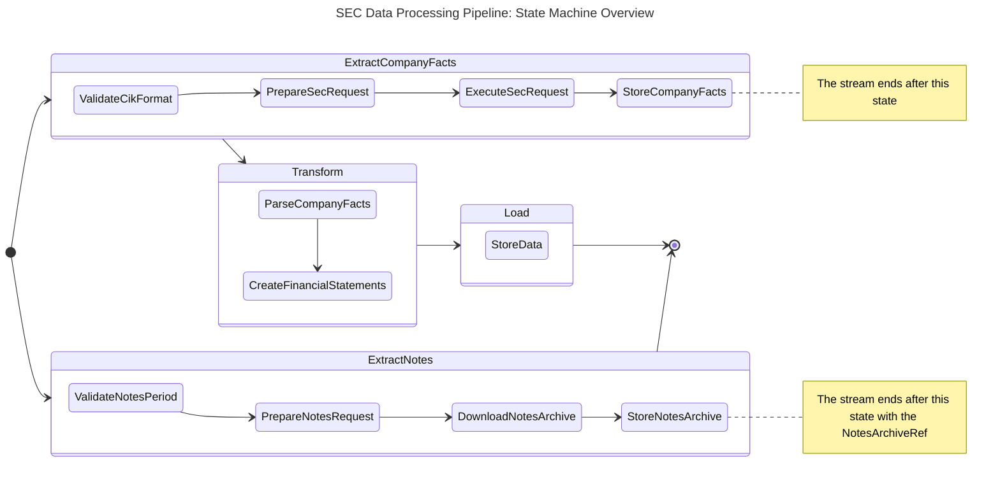

```mermaid
---
title: "SEC Data Processing Pipeline: State Machine Overview"
---
stateDiagram-v2
    %% Align all the SuperStates from left-to-right
    direction LR

    %% `ExtractCompanyFacts` SuperState
    [*] --> ExtractCompanyFacts
    state ExtractCompanyFacts {
        ValidateCikFormat --> PrepareSecRequest
        PrepareSecRequest --> ExecuteSecRequest
        ExecuteSecRequest --> StoreCompanyFacts
        note right of StoreCompanyFacts : The stream ends after this state
    }

    ExtractCompanyFacts --> Transform

    %% `ExtractNotes` SuperState, one per Notes file
    [*] --> ExtractNotes
    state ExtractNotes {
        ValidateNotesPeriod --> PrepareNotesRequest
        PrepareNotesRequest --> DownloadNotesArchive
        DownloadNotesArchive --> StoreNotesArchive
        note right of StoreNotesArchive : The stream ends after this state with the NotesArchiveRef
    }

    ExtractNotes --> [*]

    %% `Transform` SuperState
    state Transform {
        ParseCompanyFacts --> CreateFinancialStatements
    }

    Transform --> Load

    %% `Load` SuperState
    state Load {
        StoreData
    }

    Load --> [*]
```
