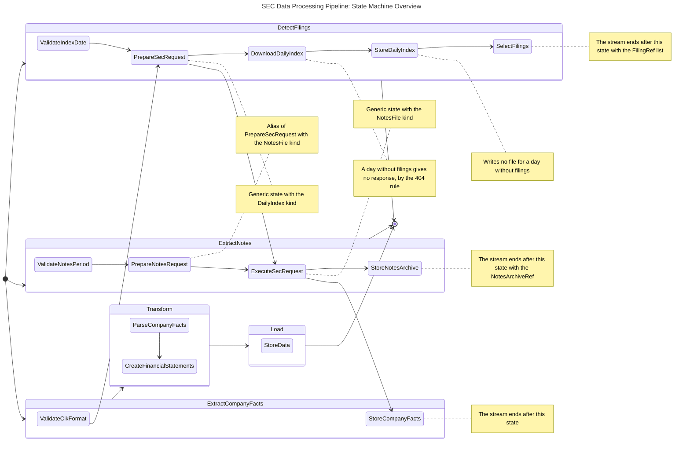

```mermaid
---
title: "SEC Data Processing Pipeline: State Machine Overview"
---
stateDiagram-v2
    %% Align all the SuperStates from left-to-right
    direction LR

    %% `ExtractCompanyFacts` SuperState
    [*] --> ExtractCompanyFacts
    state ExtractCompanyFacts {
        ValidateCikFormat --> PrepareSecRequest
        PrepareSecRequest --> ExecuteSecRequest
        ExecuteSecRequest --> StoreCompanyFacts
        note right of StoreCompanyFacts : The stream ends after this state
    }

    ExtractCompanyFacts --> Transform

    %% `ExtractNotes` SuperState, one per Notes file
    [*] --> ExtractNotes
    state ExtractNotes {
        ValidateNotesPeriod --> PrepareNotesRequest
        PrepareNotesRequest --> ExecuteSecRequest
        note right of PrepareNotesRequest : Alias of PrepareSecRequest with the NotesFile kind
        note right of ExecuteSecRequest : Generic state with the NotesFile kind
        ExecuteSecRequest --> StoreNotesArchive
        note right of StoreNotesArchive : The stream ends after this state with the NotesArchiveRef
    }

    ExtractNotes --> [*]

    %% `DetectFilings` SuperState, one per day
    [*] --> DetectFilings
    state DetectFilings {
        ValidateIndexDate --> PrepareSecRequest
        note right of PrepareSecRequest : Generic state with the DailyIndex kind
        PrepareSecRequest --> DownloadDailyIndex
        note right of DownloadDailyIndex : A day without filings gives no response, by the 404 rule
        DownloadDailyIndex --> StoreDailyIndex
        note right of StoreDailyIndex : Writes no file for a day without filings
        StoreDailyIndex --> SelectFilings
        note right of SelectFilings : The stream ends after this state with the FilingRef list
    }

    DetectFilings --> [*]

    %% `Transform` SuperState
    state Transform {
        ParseCompanyFacts --> CreateFinancialStatements
    }

    Transform --> Load

    %% `Load` SuperState
    state Load {
        StoreData
    }

    Load --> [*]
```
