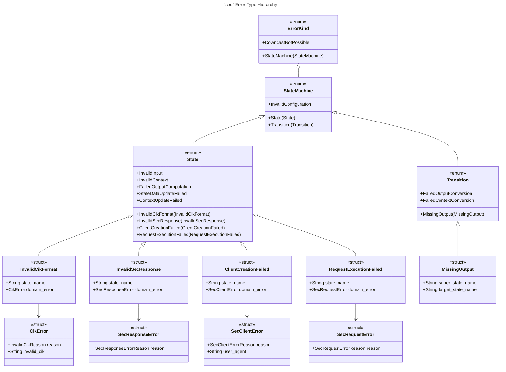

```mermaid
---
title: "`sec` Error Type Hierarchy"
---
classDiagram
    class ErrorKind{
        <<enum>>
        %% Top-level error enum for all SEC state machine errors
        +StateMachine(StateMachine)
        +DowncastNotPossible
    }

    class StateMachine{
        <<enum>>
        %% Errors during state machine execution
        +State(State)
        +Transition(Transition)
        +InvalidConfiguration
    }

    class State {
        <<enum>>
        %% Errors from internal state operations
        +InvalidCikFormat(InvalidCikFormat)
        +InvalidSecResponse(InvalidSecResponse)
        +ClientCreationFailed(ClientCreationFailed)
        +RequestExecutionFailed(RequestExecutionFailed)
        +InvalidInput
        +InvalidContext
        +FailedOutputComputation
        +StateDataUpdateFailed
        +ContextUpdateFailed
    }

    class Transition {
        <<enum>>
        %% Errors during state transitions
        +MissingOutput(MissingOutput)
        +FailedOutputConversion
        +FailedContextConversion
    }

    class InvalidCikFormat{
        <<struct>>
        %% State-level wrapper for CIK validation errors
        +String state_name
        +CikError domain_error
    }

    class InvalidSecResponse{
        <<struct>>
        %% State-level wrapper for SEC response errors
        +String state_name
        +SecResponseError domain_error
    }

    class ClientCreationFailed{
        <<struct>>
        %% State-level wrapper for client creation errors
        +String state_name
        +SecClientError domain_error
    }

    class RequestExecutionFailed{
        <<struct>>
        %% State-level wrapper for request execution errors
        +String state_name
        +SecRequestError domain_error
    }

    class MissingOutput{
        <<struct>>
        %% Transition-level error for missing output data
        +String super_state_name
        +String target_state_name
    }

    class CikError{
        <<struct>>
        %% Domain error for invalid CIK format
        +InvalidCikReason reason
        +String invalid_cik
    }

    class SecResponseError{
        <<struct>>
        %% Domain error for SEC response processing
        +SecResponseErrorReason reason
    }

    class SecClientError{
        <<struct>>
        %% Domain error for SEC client creation
        +SecClientErrorReason reason
        +String user_agent
    }

    class SecRequestError{
        <<struct>>
        %% Domain error for SEC request execution
        +SecRequestErrorReason reason
    }

    %% Error hierarchy relationships
    ErrorKind <|-- StateMachine
    StateMachine <|-- State
    StateMachine <|-- Transition
    
    %% State error wraps domain errors
    State <|-- InvalidCikFormat
    State <|-- InvalidSecResponse
    State <|-- ClientCreationFailed
    State <|-- RequestExecutionFailed
    
    %% Transition error wraps specific errors
    Transition <|-- MissingOutput
    
    %% State wrappers contain domain errors
    InvalidCikFormat --> CikError
    InvalidSecResponse --> SecResponseError
    ClientCreationFailed --> SecClientError
    RequestExecutionFailed --> SecRequestError
```