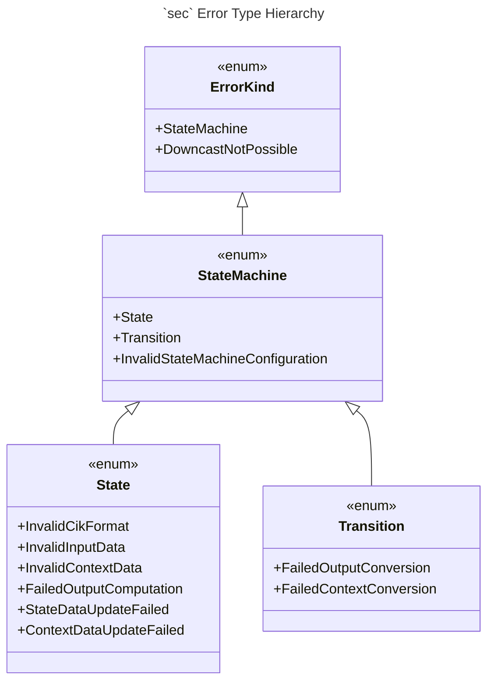

```mermaid
---
title: "`sec` Error Type Hierarchy"
---
classDiagram
    class ErrorKind{
        <<enum>>
        %% This is an enum that represents all kinds of errors that are expected in the `sec`package.
        +StateMachine
        +DowncastNotPossible
    }

    class State {
        <<enum>>
        %% This is an enum that represents an error in the `sec` package that is caused by a computation that has been done internally inside a `State` in the `StateMachine`.
        +InvalidCikFormat
        +InvalidInputData
        +InvalidContextData
        +FailedOutputComputation
        +StateDataUpdateFailed
        +ContextDataUpdateFailed
    }


    class Transition {
        <<enum>>
        %% This is an enum that represents an error which occured during the transition from one `State` in the `StateMachine`to another `State`.
        +FailedOutputConversion
        +FailedContextConversion
    }

    class StateMachine{
        <<enum>>
        %% This is an enum that represents an error which occured during the execution of a `StateMachine`. It can either be attributed to a specific `State` computation, a `Transition` between States or a general misconfiguration of the `StateMachine`.
        +State
        +Transition
        +InvalidStateMachineConfiguration
    }

    %% Relationships
    ErrorKind <|-- StateMachine
    StateMachine <|-- State
    StateMachine <|-- Transition
    
```