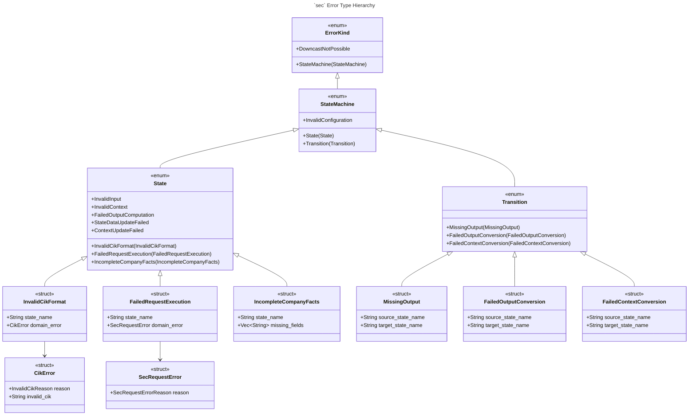

```mermaid
---
title: "`sec` Error Type Hierarchy"
---
classDiagram
    class ErrorKind{
        <<enum>>
        %% Top-level error enum for all SEC state machine errors
        +StateMachine(StateMachine)
        +DowncastNotPossible
    }

    class StateMachine{
        <<enum>>
        %% Errors during state machine execution
        +State(State)
        +Transition(Transition)
        +InvalidConfiguration
    }

    class State {
        <<enum>>
        %% Errors from internal state operations
        +InvalidCikFormat(InvalidCikFormat)
        +FailedRequestExecution(FailedRequestExecution)
        +IncompleteCompanyFacts(IncompleteCompanyFacts)
        +InvalidInput
        +InvalidContext
        +FailedOutputComputation
        +StateDataUpdateFailed
        +ContextUpdateFailed
    }

    class Transition {
        <<enum>>
        %% Errors during state transitions
        +MissingOutput(MissingOutput)
        +FailedOutputConversion(FailedOutputConversion)
        +FailedContextConversion(FailedContextConversion)
    }

    class InvalidCikFormat{
        <<struct>>
        %% State-level wrapper for CIK validation errors
        +String state_name
        +CikError domain_error
    }

    class FailedRequestExecution{
        <<struct>>
        %% State-level wrapper for request execution errors
        +String state_name
        +SecRequestError domain_error
    }

    class IncompleteCompanyFacts{
        <<struct>>
        %% State-level error for missing XBRL concepts
        +String state_name
        +Vec~String~ missing_fields
    }

    class MissingOutput{
        <<struct>>
        %% Transition-level error for missing output data
        +String source_state_name
        +String target_state_name
    }

    class FailedOutputConversion{
        <<struct>>
        %% Transition-level error for output-to-input conversion failure
        +String source_state_name
        +String target_state_name
    }

    class FailedContextConversion{
        <<struct>>
        %% Transition-level error for context conversion failure
        +String source_state_name
        +String target_state_name
    }

    class CikError{
        <<struct>>
        %% Domain error for invalid CIK format
        +InvalidCikReason reason
        +String invalid_cik
    }

    class SecRequestError{
        <<struct>>
        %% Domain error for SEC request execution
        +SecRequestErrorReason reason
    }

    %% Error hierarchy relationships
    ErrorKind <|-- StateMachine
    StateMachine <|-- State
    StateMachine <|-- Transition

    %% State error wraps domain errors
    State <|-- InvalidCikFormat
    State <|-- FailedRequestExecution
    State <|-- IncompleteCompanyFacts

    %% Transition error wraps specific errors
    Transition <|-- MissingOutput
    Transition <|-- FailedOutputConversion
    Transition <|-- FailedContextConversion

    %% State wrappers contain domain errors
    InvalidCikFormat --> CikError
    FailedRequestExecution --> SecRequestError
```
