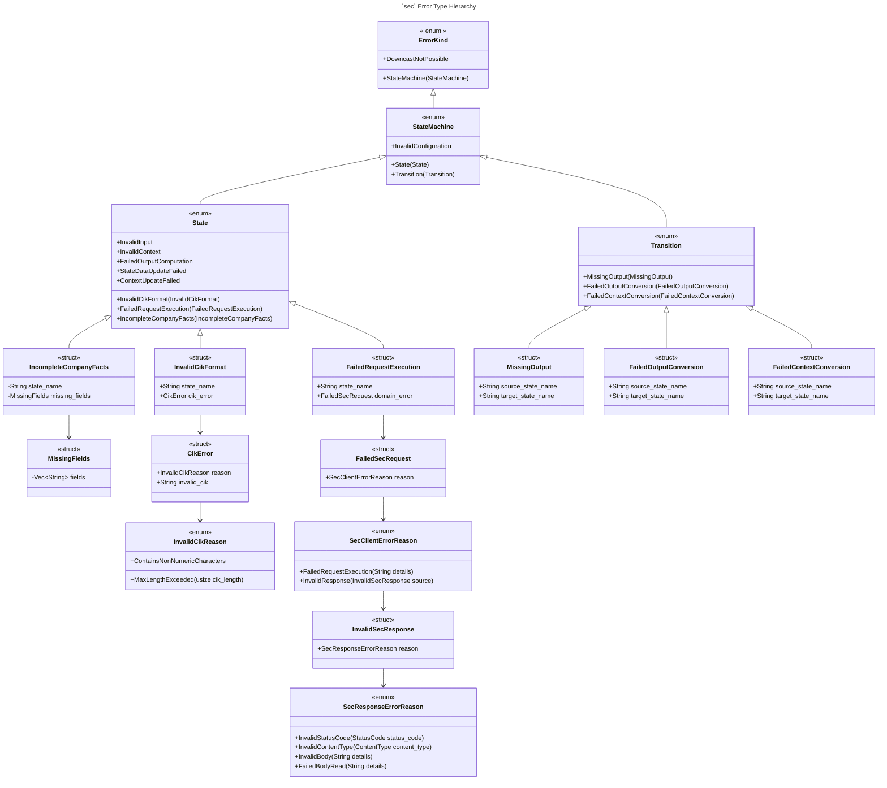

```mermaid
---
title: "`sec` Error Type Hierarchy"
---
classDiagram
    class ErrorKind{
        << enum >>
        %% Top-level error enum for all SEC state machine errors
        +StateMachine(StateMachine)
        +DowncastNotPossible
    }

    class StateMachine{
        <<enum>>
        %% Errors during state machine execution
        +InvalidConfiguration
        +State(State)
        +Transition(Transition)
    }

    class State {
        <<enum>>
        %% Errors from internal state operations
        +InvalidCikFormat(InvalidCikFormat)
        +FailedRequestExecution(FailedRequestExecution)
        +IncompleteCompanyFacts(IncompleteCompanyFacts)
        +InvalidInput
        +InvalidContext
        +FailedOutputComputation
        +StateDataUpdateFailed
        +ContextUpdateFailed
    }

    class Transition {
        <<enum>>
        %% Errors during state transitions
        +MissingOutput(MissingOutput)
        +FailedOutputConversion(FailedOutputConversion)
        +FailedContextConversion(FailedContextConversion)
    }

    class InvalidCikFormat{
        <<struct>>
        %% State-level wrapper for CIK validation errors
        +String state_name
        +CikError cik_error
    }

    class FailedRequestExecution{
        <<struct>>
        %% State-level wrapper for request execution errors
        +String state_name
        +FailedSecRequest domain_error
    }

    class IncompleteCompanyFacts{
        <<struct>>
        %% State-level error for missing XBRL concepts
        -String state_name
        -MissingFields missing_fields
    }

    class MissingFields{
        <<struct>>
        %% Newtype over the canonical names of the missing concepts
        -Vec~String~ fields
    }

    class MissingOutput{
        <<struct>>
        %% Transition-level error for missing output data
        +String source_state_name
        +String target_state_name
    }

    class FailedOutputConversion{
        <<struct>>
        %% Transition-level error for output-to-input conversion failure
        +String source_state_name
        +String target_state_name
    }

    class FailedContextConversion{
        <<struct>>
        %% Transition-level error for context conversion failure
        +String source_state_name
        +String target_state_name
    }

    class CikError{
        <<struct>>
        %% Domain error for invalid CIK format
        +InvalidCikReason reason
        +String invalid_cik
    }

    class InvalidCikReason{
        <<enum>>
        %% Why a string failed CIK validation
        +MaxLengthExceeded(usize cik_length)
        +ContainsNonNumericCharacters
    }

    class FailedSecRequest{
        <<struct>>
        %% Domain error for SEC request execution
        +SecClientErrorReason reason
    }

    class SecClientErrorReason{
        <<enum>>
        %% `sec_client::error::ErrorReason`, renamed here for diagram uniqueness
        +FailedRequestExecution(String details)
        +InvalidResponse(InvalidSecResponse source)
    }

    class InvalidSecResponse{
        <<struct>>
        %% Domain error for a response that failed SEC validation
        +SecResponseErrorReason reason
    }

    class SecResponseErrorReason{
        <<enum>>
        %% `sec_response::error::ErrorReason`, renamed here for diagram uniqueness
        +InvalidStatusCode(StatusCode status_code)
        +InvalidContentType(ContentType content_type)
        +InvalidBody(String details)
        +FailedBodyRead(String details)
    }

    %% Error hierarchy relationships
    ErrorKind <|-- StateMachine
    StateMachine <|-- State
    StateMachine <|-- Transition

    %% State error wraps domain errors
    State <|-- InvalidCikFormat
    State <|-- FailedRequestExecution
    State <|-- IncompleteCompanyFacts

    %% Transition error wraps specific errors
    Transition <|-- MissingOutput
    Transition <|-- FailedOutputConversion
    Transition <|-- FailedContextConversion

    %% State wrappers contain domain errors
    InvalidCikFormat --> CikError
    CikError --> InvalidCikReason
    IncompleteCompanyFacts --> MissingFields
    FailedRequestExecution --> FailedSecRequest
    FailedSecRequest --> SecClientErrorReason
    SecClientErrorReason --> InvalidSecResponse
    InvalidSecResponse --> SecResponseErrorReason
```
