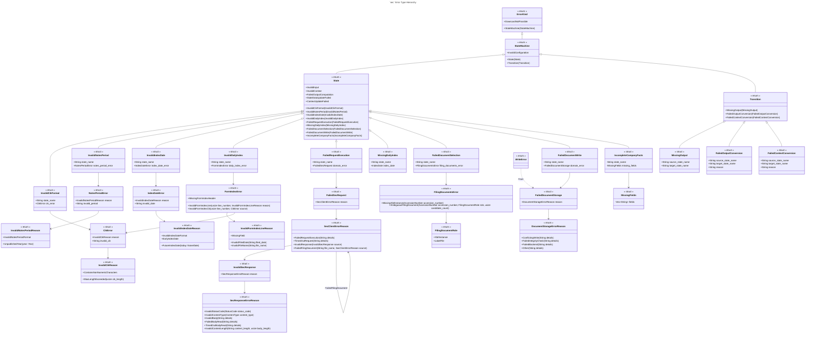

```mermaid
---
title: "`sec` Error Type Hierarchy"
---
classDiagram
    class ErrorKind{
        << enum >>
        %% Top-level error enum for all SEC state machine errors
        +StateMachine(StateMachine)
        +DowncastNotPossible
    }

    class StateMachine{
        << enum >>
        %% Errors during state machine execution
        +InvalidConfiguration
        +State(State)
        +Transition(Transition)
    }

    class State {
        << enum >>
        %% Errors from internal state operations
        +InvalidCikFormat(InvalidCikFormat)
        +InvalidNotesPeriod(InvalidNotesPeriod)
        +InvalidIndexDate(InvalidIndexDate)
        +InvalidDailyIndex(InvalidDailyIndex)
        +FailedRequestExecution(FailedRequestExecution)
        +MissingDailyIndex(MissingDailyIndex)
        +FailedDocumentSelection(FailedDocumentSelection)
        +FailedDocumentWrite(FailedDocumentWrite)
        +IncompleteCompanyFacts(IncompleteCompanyFacts)
        +InvalidInput
        +InvalidContext
        +FailedOutputComputation
        +StateDataUpdateFailed
        +ContextUpdateFailed
    }

    class Transition {
        << enum >>
        %% Errors during state transitions
        +MissingOutput(MissingOutput)
        +FailedOutputConversion(FailedOutputConversion)
        +FailedContextConversion(FailedContextConversion)
    }

    class InvalidCikFormat{
        << struct >>
        %% State-level wrapper for CIK validation errors
        +String state_name
        +CikError cik_error
    }

    class InvalidNotesPeriod{
        << struct >>
        %% State-level wrapper for Notes period validation errors
        +String state_name
        +NotesPeriodError notes_period_error
    }

    class InvalidIndexDate{
        << struct >>
        %% State-level wrapper for index date validation errors
        +String state_name
        +IndexDateError index_date_error
    }

    class InvalidDailyIndex{
        << struct >>
        %% State-level wrapper for a daily index that does not parse into rows
        +String state_name
        +FormIndexError daily_index_error
    }

    class FailedRequestExecution{
        << struct >>
        %% State-level wrapper for request execution errors
        +String state_name
        +FailedSecRequest domain_error
    }

    class MissingDailyIndex{
        << struct >>
        %% State-level leaf error for a daily index the SEC did not send
        +String state_name
        +IndexDate index_date
    }

    class FailedDocumentSelection{
        << struct >>
        %% State-level wrapper for a filing folder with no single XBRL instance or label file
        +String state_name
        +FilingDocumentsError filing_documents_error
    }

    class FailedDocumentWrite{
        << struct >>
        %% State-level wrapper for a write that the store rejected
        +String state_name
        +FailedDocumentStorage domain_error
    }

    class FailedDocumentStorage{
        << struct >>
        %% Domain error for a document that the store did not keep
        +DocumentStorageErrorReason reason
    }

    class DocumentStorageErrorReason{
        << enum >>
        %% Why the store did not keep the document
        +ConflictingWrite(String details)
        +FailedIntegrityCheck(String details)
        +FailedBackend(String details)
        +Other(String details)
    }

    class WriteError{
        << enum >>
        %% `storage::WriteError`, converted at the boundary and never held
    }

    class IncompleteCompanyFacts{
        << struct >>
        %% State-level error for missing XBRL concepts
        -String state_name
        -MissingFields missing_fields
    }

    class MissingFields{
        << struct >>
        %% Newtype over the canonical names of the missing concepts
        -Vec~String~ fields
    }

    class MissingOutput{
        << struct >>
        %% Transition-level error for missing output data
        +String source_state_name
        +String target_state_name
    }

    class FailedOutputConversion{
        << struct >>
        %% Transition-level error for output-to-input conversion failure
        +String source_state_name
        +String target_state_name
        +String reason
    }

    class FailedContextConversion{
        << struct >>
        %% Transition-level error for context conversion failure
        +String source_state_name
        +String target_state_name
        +String reason
    }

    class CikError{
        << struct >>
        %% Domain error for invalid CIK format
        +InvalidCikReason reason
        +String invalid_cik
    }

    class NotesPeriodError{
        << struct >>
        %% Domain error for an invalid Notes period
        +InvalidNotesPeriodReason reason
        +String invalid_period
    }

    class InvalidNotesPeriodReason{
        << enum >>
        %% Why a string failed Notes period validation
        +InvalidNotesPeriodFormat
        +UnpublishedYear(year: Year)
    }

    class IndexDateError{
        << struct >>
        %% Domain error for an invalid index date
        +InvalidIndexDateReason reason
        +String invalid_date
    }

    class InvalidIndexDateReason{
        << enum >>
        %% Why a string failed index date validation
        +InvalidIndexDateFormat
        +EarlyIndexDate
        +FutureIndexDate(today: NaiveDate)
    }

    class FormIndexError{
        << enum >>
        %% Domain error for a daily index or a full index that does not parse into rows
        +MissingFormIndexHeader
        +InvalidFormIndexLine(usize line_number, InvalidFormIndexLineReason reason)
        +InvalidFormIndexCik(usize line_number, CikError source)
    }

    class InvalidFormIndexLineReason{
        << enum >>
        %% Why a line of a form index is malformed
        +MissingField
        +InvalidFiledDate(String filed_date)
        +InvalidFileName(String file_name)
    }

    class FilingDocumentsError{
        << enum >>
        %% Domain error for a filing folder with no single XBRL instance or label file
        +MissingXbrlInstance(AccessionNumber accession_number)
        +AmbiguousFilingDocument(AccessionNumber accession_number, FilingDocumentRole role, usize candidate_count)
    }

    class FilingDocumentRole{
        << enum >>
        %% Which document of a filing folder a lookup selects
        +XbrlInstance
        +LabelFile
    }

    class InvalidCikReason{
        << enum >>
        %% Why a string failed CIK validation
        +MaxLengthExceeded(usize cik_length)
        +ContainsNonNumericCharacters
    }

    class FailedSecRequest{
        << struct >>
        %% Domain error for SEC request execution
        +SecClientErrorReason reason
    }

    class SecClientErrorReason{
        << enum >>
        %% `sec_client::error::ErrorReason`, renamed here for diagram uniqueness
        +FailedRequestExecution(String details)
        +TimedOutRequest(String details)
        +InvalidResponse(InvalidSecResponse source)
        +FailedFilingDocument(String file_name, SecClientErrorReason source)
    }

    class InvalidSecResponse{
        << struct >>
        %% Domain error for a response that failed SEC validation
        +SecResponseErrorReason reason
    }

    class SecResponseErrorReason{
        << enum >>
        %% `sec_response::error::ErrorReason`, renamed here for diagram uniqueness
        +InvalidStatusCode(StatusCode status_code)
        +InvalidContentType(ContentType content_type)
        +InvalidBody(String details)
        +FailedBodyRead(String details)
        +TimedOutBodyRead(String details)
        +InvalidContentLength(String content_length, usize body_length)
    }

    %% Error hierarchy relationships
    ErrorKind <|-- StateMachine
    StateMachine <|-- State
    StateMachine <|-- Transition

    %% State error wraps domain errors
    State <|-- InvalidCikFormat
    State <|-- InvalidNotesPeriod
    State <|-- InvalidIndexDate
    State <|-- InvalidDailyIndex
    State <|-- FailedRequestExecution
    State <|-- MissingDailyIndex
    State <|-- FailedDocumentSelection
    State <|-- FailedDocumentWrite
    State <|-- IncompleteCompanyFacts

    %% Transition error wraps specific errors
    Transition <|-- MissingOutput
    Transition <|-- FailedOutputConversion
    Transition <|-- FailedContextConversion

    %% State wrappers contain domain errors
    InvalidCikFormat --> CikError
    CikError --> InvalidCikReason
    InvalidNotesPeriod --> NotesPeriodError
    NotesPeriodError --> InvalidNotesPeriodReason
    InvalidIndexDate --> IndexDateError
    IndexDateError --> InvalidIndexDateReason
    InvalidDailyIndex --> FormIndexError
    FormIndexError --> InvalidFormIndexLineReason
    FormIndexError --> CikError
    FailedDocumentSelection --> FilingDocumentsError
    FilingDocumentsError --> FilingDocumentRole
    IncompleteCompanyFacts --> MissingFields
    FailedRequestExecution --> FailedSecRequest
    FailedDocumentWrite --> FailedDocumentStorage
    FailedDocumentStorage --> DocumentStorageErrorReason
    WriteError ..> FailedDocumentStorage : From
    FailedSecRequest --> SecClientErrorReason
    SecClientErrorReason --> InvalidSecResponse
    SecClientErrorReason --> SecClientErrorReason : FailedFilingDocument
    InvalidSecResponse --> SecResponseErrorReason
```
