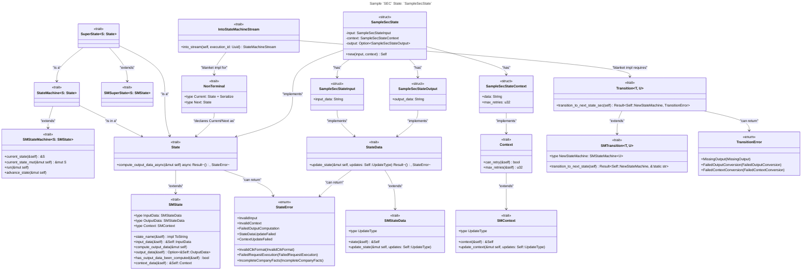

```mermaid
---
title: "Sample `SEC` State: `SampleSecState`"
---
classDiagram
    class StateMachine~S: State~{
        <<trait>>
        %% SEC-specific StateMachine trait: `SMStateMachine<S> + Display`
    }

    class SMStateMachine~S: SMState~{
        <<trait>>
        %% Base StateMachine trait from `state_maschine`

        +current_state(&self) &S
        +current_state_mut(&mut self) &mut S
        +run(&mut self)
        +advance_state(&mut self)
    }

    class SuperState~S: State~ {
        <<trait>>
        %% SEC-specific SuperState trait: `State + StateMachine<S>`
    }

    class SMSuperState~S: SMState~ {
        <<trait>>
        %% Base SuperState trait from `state_maschine`
    }

    class SMState {
        <<trait>>
        %% Base State trait from `state_maschine`
        +type InputData: SMStateData
        +type OutputData: SMStateData
        +type Context: SMContext
        +state_name(&self) impl ToString
        +input_data(&self) &Self::InputData
        +compute_output_data(&mut self)
        +output_data(&self) Option~&Self::OutputData~
        +has_output_data_been_computed(&self) bool
        +context_data(&self) &Self::Context
    }

    class State {
        <<trait>>
        %% SEC-specific State trait: `SMState + Display`, async via `#[async_trait]`
        +compute_output_data_async(&mut self) async Result~(), StateError~
    }

    class SMStateData {
        <<trait>>
        %% Base StateData trait from `state_maschine`
        +type UpdateType
        +state(&self) &Self
        +update_state(&mut self, updates: Self::UpdateType)
    }

    class StateData {
        <<trait>>
        %% SEC-specific StateData trait
        +update_state(&mut self, updates: Self::UpdateType) Result~(), StateError~
    }

    class SMContext {
        <<trait>>
        %% Base Context trait from `state_maschine`
        +type UpdateType
        +context(&self) &Self
        +update_context(&mut self, updates: Self::UpdateType)
    }

    class Context {
        <<trait>>
        %% SEC-specific Context trait
        +can_retry(&self) bool
        +max_retries(&self) u32
    }

    class SMTransition~T, U~ {
        <<trait>>
        %% Base Transition trait from `state_maschine`: `StateMachine<T>`
        +type NewStateMachine: SMStateMachine~U~
        +transition_to_next_state(self) Result~Self::NewStateMachine, &'static str~
    }

    class Transition~T, U~ {
        <<trait>>
        %% SEC-specific Transition trait
        +transition_to_next_state_sec(self) Result~Self::NewStateMachine, TransitionError~
    }

    class NonTerminal {
        <<trait>>
        %% Marks a state machine as sitting at a non-terminal state
        +type Current: State + Serialize
        +type Next: State
    }

    class IntoStateMachineStream {
        <<trait>>
        %% Drives a state machine to completion as an async event stream
        +into_stream(self, execution_id: Uuid) StateMachineStream
    }

    class StateError {
        <<enum>>
        %% SEC-specific state errors, see `sec_error_handling.md`
        +InvalidCikFormat(InvalidCikFormat)
        +FailedRequestExecution(FailedRequestExecution)
        +IncompleteCompanyFacts(IncompleteCompanyFacts)
        +InvalidInput
        +InvalidContext
        +FailedOutputComputation
        +StateDataUpdateFailed
        +ContextUpdateFailed
    }

    class TransitionError {
        <<enum>>
        %% SEC-specific transition errors, see `sec_error_handling.md`
        +MissingOutput(MissingOutput)
        +FailedOutputConversion(FailedOutputConversion)
        +FailedContextConversion(FailedContextConversion)
    }

    class SampleSecState {
        <<struct>>
        %% A sample SEC State implementation, represents any 'SecState'
        -input: SampleSecStateInput
        -context: SampleSecStateContext
        -output: Option~SampleSecStateOutput~
        +new(input, context) Self
    }

    class SampleSecStateInput {
        <<struct>>
        %% Input for SampleSecState
        +input_data: String
    }

    class SampleSecStateOutput {
        <<struct>>
        %% Output for SampleSecState
        +output_data: String
    }

    class SampleSecStateContext {
        <<struct>>
        %% Context for SampleSecState
        +data: String
        +max_retries: u32
    }

    %% is-relationships
    StateMachine --> State : "is in a"
    SuperState --> StateMachine : "is a"
    SuperState --> State : "is a"

    %% SEC-specific trait inheritance
    StateMachine --> SMStateMachine : "extends"
    SuperState --> SMSuperState : "extends"
    State --> SMState : "extends"
    StateData --> SMStateData : "extends"
    Context --> SMContext : "extends"
    Transition --> SMTransition : "extends"

    %% Streaming
    NonTerminal --> State : "declares Current/Next as"
    IntoStateMachineStream --> NonTerminal : "blanket impl for"
    IntoStateMachineStream --> Transition : "blanket impl requires"

    %% Trait implementations
    SampleSecState --> State : "implements"
    SampleSecStateInput --> StateData : "implements"
    SampleSecStateOutput --> StateData : "implements"
    SampleSecStateContext --> Context : "implements"

    %% Struct relationships
    SampleSecState --> SampleSecStateInput : "has"
    SampleSecState --> SampleSecStateOutput : "has"
    SampleSecState --> SampleSecStateContext : "has"

    %% Error relationships
    State --> StateError : "can return"
    StateData --> StateError : "can return"
    Transition --> TransitionError : "can return"
```
