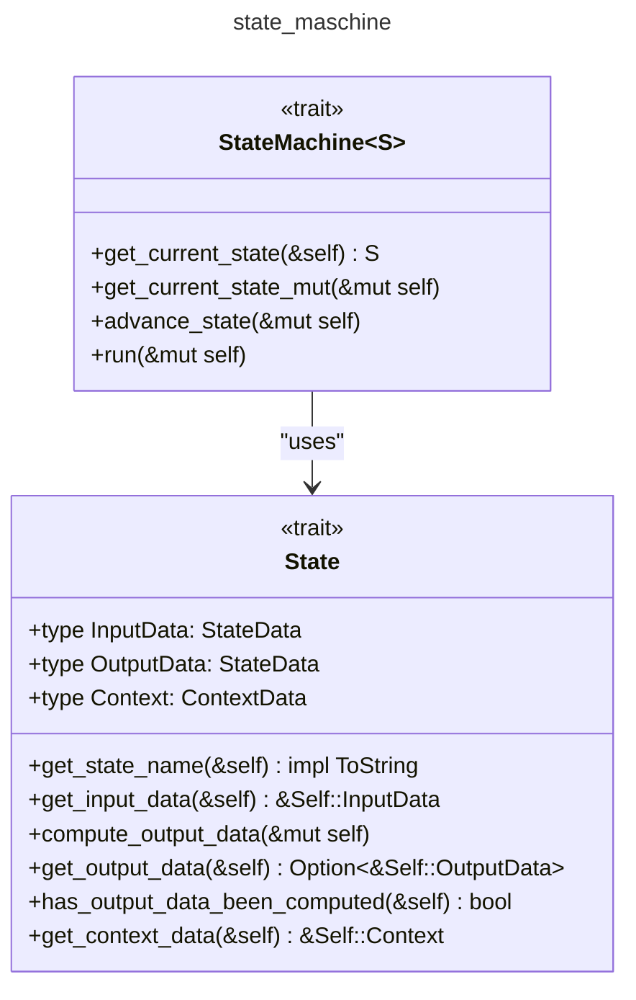

```mermaid
---
title: state_maschine
---
classDiagram
    class StateMachine~S~{
        <<trait>>
        +get_current_state(&self) S
        +get_current_state_mut(&mut self)
        +advance_state(&mut self)
        +run(&mut self)
    }

    class State {
        <<trait>>

        %% This is a trait that represents a `State` in the `StateMachine`.

        %% These are the associated types that represent the data associated with a `State`inside a `StateMachine' represents the data associated with a `State`.
        +type InputData: StateData
        +type OutputData: StateData
        +type Context: ContextData

        %% These are the trait methods that must be implemented by any `State` in the `StateMachine`.
        +get_state_name(&self) impl ToString
        +get_input_data(&self) &Self::InputData
        +compute_output_data(&mut self)
        +get_output_data(&self) Option<&Self::OutputData>
        +has_output_data_been_computed(&self) bool
        +get_context_data(&self) &Self::Context
    }

    StateMachine --> State : "uses"
```
