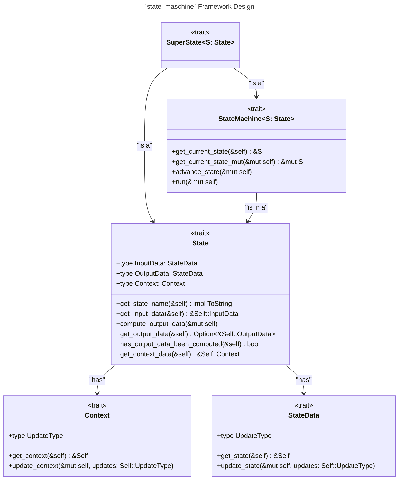

```mermaid
---
title: "`state_maschine` Framework Design"
---
classDiagram
    class StateMachine~S: State~{
        <<trait>>
        %% This is a trait that represents a `StateMachine`.

        %% These are the trait methods that must be implemented by any `StateMachine`.
        +get_current_state(&self) &S
        +get_current_state_mut(&mut self) &mut S
        +advance_state(&mut self)
        +run(&mut self)
    }

    class State {
        <<trait>>
        %% This is a trait that represents a `State` in the `StateMachine`.

        %% These are the associated types that represent the data associated with a `State`inside a `StateMachine' represents the data associated with a `State`.
        +type InputData: StateData
        +type OutputData: StateData
        +type Context: Context

        %% These are the trait methods that must be implemented by any `State` in the `StateMachine`.
        +get_state_name(&self) impl ToString
        +get_input_data(&self) &Self::InputData
        +compute_output_data(&mut self)
        +get_output_data(&self) Option<&Self::OutputData>
        +has_output_data_been_computed(&self) bool
        +get_context_data(&self) &Self::Context
    }


    class SuperState~S: State~ {
        <<trait>>
        %% This is a trait that represents a `SuperState` in a hierarchical state machine.
        %% A `SuperState` must implement both `State` and `StateMachine<S>` traits.

        %% Associated types and methods are inherited from `State` and `StateMachine<S>`.
    }

    class Context {
        <<trait>>
        %% This is a trait that defines the behavior and characteristics of context data that is available to a `State` in a `StateMachine`.

        %% Associated type for updates to the context data.
        +type UpdateType

        %% Methods defined by the `Context` trait.
        +get_context(&self) &Self
        +update_context(&mut self, updates: Self::UpdateType)
    }    

    class StateData {
        <<trait>>
        %% This is a trait that defines the behavior and characteristics of internal state data of a `State` in a `StateMachine`.

        %% Associated type for updates to the internal state data.
        +type UpdateType

        %% Methods defined by the `StateData` trait.
        +get_state(&self) &Self
        +update_state(&mut self, updates: Self::UpdateType)
    }

    %% Relationships
    %% `SuperState`is a `State` that is also a `StateMachine`
    SuperState --> StateMachine : "is a"
    SuperState --> State : "is a"

    %% A `StateMachine`is always in a specific `State`
    StateMachine --> State : "is in a"

    %% A `State` stores internal `StateData`and has access to `Context`
    State --> Context : "has"
    State --> StateData : "has"
```
