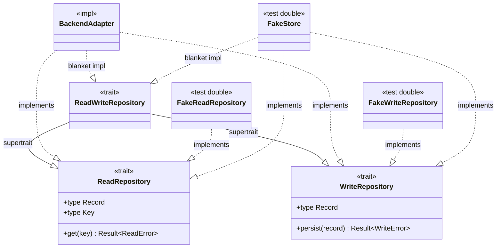

# Capability-Split Trait Hierarchy for the `storage` Ports

> Context: STA-159 [DESIGN]. This document is the concrete contract for splitting the `storage`
> persistence ports by access capability. STA-157 chose the approach (capability traits, not a
> type-state marker) and recorded the trade-offs in
> [`capability_split_ports.md`](./capability_split_ports.md). This document turns that choice into
> the exact trait definitions the implementation and test tickets build against.
>
> **Scope.** This document owns the trait shape: `WriteRepository`, `ReadRepository`, the
> `ReadWriteRepository` supertrait, their associated types, object-safety, dispatch, and the
> capability binding a `State` uses. It does **not** own the error hierarchy. STA-147 owns the error
> shape; this document references it and maps the traits onto it.

## Purpose

The `storage` crate exposes one write-only port today. A caller that only reads has no read method,
and a caller handed the port can call `persist`. The goal is a design where the type system enforces
the capability: a read-only caller cannot call a write method, and the mistake is a compile error.

The split also gives one capability model for two backends. The database repository and the future
queue-backed repository both express access as the same read and write traits.
[`capability_split_ports.md`](./capability_split_ports.md) records the queue mapping.

## The Current Port

The `storage` crate holds one trait, `Repository`, with a single write method:

```rust
#[async_trait]
pub trait Repository: Send + Sync {
    type Record: Send;
    async fn persist(&self, record: Self::Record) -> Result<(), WriteError>;
}
```

The rename to `WriteRepository` and the new `ReadRepository` sibling are the whole change on the
trait side. The read side is a new trait, not a rework of the write side.

## The Three Traits

### `WriteRepository`

`WriteRepository` is the current `Repository`, renamed. The method and the associated type are
unchanged, so the write contract stays exact.

```rust
#[async_trait]
pub trait WriteRepository: Send + Sync {
    /// The unit of persistence this repository accepts — one record per `persist` call.
    type Record: Send;

    /// Persists a single record.
    async fn persist(&self, record: Self::Record) -> Result<(), WriteError>;
}
```

- `Record` is the write-unit. An implementor binds it to its concrete type, for example a filing
  record. It is `Send` because `persist` moves it across an `async` boundary.
- `persist` returns `WriteError`, the narrow write class. It never returns a read failure.

### `ReadRepository`

`ReadRepository` is the new sibling. It reads one record by key.

```rust
#[async_trait]
pub trait ReadRepository: Send + Sync {
    /// The unit this repository returns — one record per `get` call.
    type Record: Send;

    /// The lookup value that identifies one record.
    type Key: Send;

    /// Reads the record for a key.
    async fn get(&self, key: Self::Key) -> Result<Option<Self::Record>, ReadError>;
}
```

- `Key` is the lookup value that identifies one record. It is `Send` because `get` moves it across
  an `async` boundary.
- `get` returns `Ok(None)` when the key resolves to no record. Absence is a normal read result, not
  a failure.
- `get` returns `ReadError` when the read itself fails at the backend. The error side is STA-147's,
  covered under [Error Mapping](#error-mapping).

### `ReadWriteRepository`

A store that offers both capabilities gets a supertrait plus a blanket impl. The supertrait adds no
method. It is one name for a store that implements both sides, and the blanket impl gives it to every
such store. A caller pins `Record` on the parent traits, not on the supertrait. See
[Capability Binding in a `State`](#capability-binding-in-a-state).

```rust
pub trait ReadWriteRepository: ReadRepository + WriteRepository {}

impl<T: ReadRepository + WriteRepository> ReadWriteRepository for T {}
```

The blanket impl gives `ReadWriteRepository` to every type that implements both sides. A backend
adapter implements `ReadRepository` and `WriteRepository`, and gets the supertrait for free.

### Full Store — the `SecClient` Implementor Shape

A store that offers both capabilities follows the `SecClient` implementor shape. `SecClient` binds
`Request`, `Response`, and `Error` on one concrete type. `execute_sec_request` ties them: it takes a
`Request` and returns a `Response`. A full store does the same across the two capability traits. One
concrete type implements both and binds `WriteRepository::Record` and `ReadRepository::Record` to the
same domain type. `persist` takes that `Record`. `get` returns it. So a write reads back as the same
type. The blanket impl then gives the type `ReadWriteRepository`.

```rust
struct FilingStore { /* backend handle */ }

#[async_trait]
impl WriteRepository for FilingStore {
    type Record = FilingRecord;
    async fn persist(&self, record: FilingRecord) -> Result<(), WriteError> { /* ... */ }
}

#[async_trait]
impl ReadRepository for FilingStore {
    type Record = FilingRecord; // the same type as the write side
    type Key = FilingKey;
    async fn get(&self, key: FilingKey) -> Result<Option<FilingRecord>, ReadError> { /* ... */ }
}
// FilingStore implements ReadWriteRepository through the blanket impl.
```

The coherence lives on the store, as it does on a `SecClient` implementor. A caller that depends on
the round-trip restates it at its bound. See [Capability Binding in a `State`](#capability-binding-in-a-state).

### Trait Hierarchy



## Associated Types

Each capability trait carries its own associated types.

| Trait | Associated types | Meaning |
| --- | --- | --- |
| `WriteRepository` | `Record` | the write-unit `persist` accepts |
| `ReadRepository` | `Record`, `Key` | the read-unit `get` returns, and the key that finds it |

A full store binds `WriteRepository::Record` and `ReadRepository::Record` to the same type, so a
record it writes reads back as the same type. The traits do not force this. A store can bind the two
`Record` types apart when the read shape and the write shape differ. Apart is the atypical case. It
drops the shared `Record` and names each `Record` on its own trait at every bound.

`ReadWriteRepository` inherits a `Record` from each parent, so a bare `RW::Record` is ambiguous. A
caller that names the associated type disambiguates it:

```rust
fn read_unit<RW: ReadWriteRepository>() -> Option<<RW as WriteRepository>::Record> {
    None
}
```

## Object Safety and Dispatch

Each trait carries `#[async_trait]`, which boxes the future the async method returns. The boxed
future makes the async method callable through a trait object. Each trait is object-safe once its
associated types are named in the `dyn` type.

```rust
// A write handle as a trait object — the associated type is named.
let writer: Box<dyn WriteRepository<Record = FilingRecord>> = /* ... */;

// A read handle as a trait object — both associated types are named.
let reader: Box<dyn ReadRepository<Record = FilingRecord, Key = FilingKey>> = /* ... */;
```

`ReadWriteRepository` cannot pin `Record`. Both parents declare `Record`, so
`ReadWriteRepository<Record = FilingRecord>` is an ambiguous associated type and does not compile. A
caller that needs both capabilities binds the two parent traits instead, as a generic bound or as two
single-capability trait objects. The blanket impl still holds, so `RW: ReadWriteRepository` stays a
valid bound where `Record` is not named. Single-capability trait objects stay available for a caller
that holds a collection of read handles or write handles.

The split keeps the dispatch options the current port has. A caller injects a concrete store by
generic bound, or holds a single-capability trait object where erasure helps.

## Capability Binding in a `State`

The store follows the same split as `SecClient`: a trait for the capability, a backend adapter that
implements it, and a fake for tests. A `State` carries its store on its context, the way a state
carries its `SecClient`. The context names the capability the state needs. A read-only state names
`ReadRepository`, so no write method is in scope.

```rust
/// A state that only reads. It has no `persist` in scope.
struct ScreenFilings<R>
where
    R: ReadRepository<Record = FilingRecord, Key = FilingKey>,
{
    store: R,
}

/// A state that only writes. It has no `get` in scope.
struct LoadFilings<W>
where
    W: WriteRepository<Record = FilingRecord>,
{
    store: W,
}

/// A state that reads and writes binds the two parent traits.
/// `RW: ReadWriteRepository` still holds through the blanket impl.
struct ReconcileFilings<RW>
where
    RW: ReadRepository<Record = FilingRecord, Key = FilingKey>
        + WriteRepository<Record = FilingRecord>,
{
    store: RW,
}
```

Production wires a real backend adapter. Tests wire a fake. The state code is blind to which, and
depends only on the capability trait. A write inside `ScreenFilings` does not compile, because
`persist` is not in scope for an `R: ReadRepository`. This is the split's benefit: the state's type
declares which capability it holds.

The guard comes from the capability the field's type carries. It does not come from the field being
generic. A generic parameter bounded by one capability carries that capability. So does a concrete
adapter that implements only that capability. Both keep `persist` out of a read-only state. A
concrete type that implements both capabilities is the one shape that drops the guard. Each state
settles its own context shape when it is designed.

## Error Mapping

STA-147 owns the `storage` error hierarchy. This document maps the traits onto it and does not
redefine it. STA-147 settled Shape A: an operation-classed hierarchy with a shared backend leaf.

```text
ErrorKind
├── Read(ReadError)
│   ├── MissingRecord
│   └── Backend(BackendError)
├── Write(WriteError)
│   ├── ConflictingWrite { reason }
│   ├── FailedIntegrityCheck { reason }
│   └── Backend(BackendError)
└── DowncastNotPossible
```

The map from method to error class:

- `WriteRepository::persist` returns `WriteError`. This class exists in the crate today.
- `ReadRepository::get` returns `ReadError`. STA-147 adds this class.
- `ErrorKind` is the union a caller propagates for any operation. `From` upcasts a class into the
  union. `TryFrom` recovers a class from the union.
- `BackendError` is the shared leaf. `ReadError::Backend` and `WriteError::Backend` both wrap it, so
  the skip-level downcast to `BackendError` works from either side.

The method return types stay narrow, so an illegal pairing cannot arise. `persist` cannot return
`MissingRecord`, and `get` cannot return `ConflictingWrite`.

`get` reports an absent key as `Ok(None)`, so `ReadError` covers a failed read, not a missing one.
`ReadError::MissingRecord` names the case where a caller requires the record to exist. A required-read
accessor that maps `Ok(None)` to `MissingRecord` is a read-side implementation choice, cut with the
read methods.

The exact variant set and the leaf names (`BackendError` included) are STA-147's decision. This
document depends on the class split: `ReadError` beside `WriteError`, both wrapping one shared leaf.
It does not depend on the leaf's final names.

## Fake Strategy Per Capability

Each capability gets its own fake, so a consumer test wires only the trait it exercises. The fakes
live in each crate's `#[cfg(test)]` fixtures, the house convention. A second consumer that needs the
same fake is the trigger to promote it to a shared testkit, not before.

- **`FakeWriteRepository<Rec>`** — the current `FakeRepository<Rec>`, renamed. It records every
  persisted record and returns `Ok`. It exposes the recorded records for assertions. This is the
  write fake unchanged.
- **`FakeReadRepository<Key, Rec>`** — seeded with key-to-record entries. Its `get` returns the
  seeded record, or `Ok(None)` for an unknown key. A test can seed it to return a `ReadError`, so
  the read failure paths have a target.
- **`FakeStore`** — one type that implements both traits, for a round-trip test that writes a record
  and reads it back. The blanket impl gives it `ReadWriteRepository`.

A read-only consumer test wires `FakeReadRepository` alone. The test then depends on the one trait
the consumer depends on, and a write path cannot leak into it.

## Out of Scope

- **Transactions and multi-record units.** The split guards one read method and one write method. It
  does not model a transaction or a multi-record unit. A later ticket decides where a transaction
  boundary sits.
- **Backend permissions.** The capability guards the read and write API at the type level. It does
  not guard the database grants. A `ReadRepository` adapter must still connect with least-privilege
  credentials. The type system cannot enforce the backend's own permissions.
- **The type-state marker.** STA-157 reserved the marker approach for a later builder that
  constructs a concrete handle. The ports stay trait-based, because the traits stay object-safe.

## Related Design Documents

- [`capability_split_ports.md`](./capability_split_ports.md) — the STA-157 findings this design
  builds on: the two approaches, the queue mapping, and the recommendation.
- [`../../../sec/design/data_model/storage_traits_design.md`](../../../sec/design/data_model/storage_traits_design.md)
  — the authoritative storage trait design (the Consolidated Design section): the neutral
  `Repository` facade, the `Backend` store base, `SecRepository`, and the error model.
- [`../../../sec/design/uml_class_diagram/sec_error_handling.md`](../../../sec/design/uml_class_diagram/sec_error_handling.md)
  — the `sec` error hierarchy that the `storage` error hierarchy mirrors.
