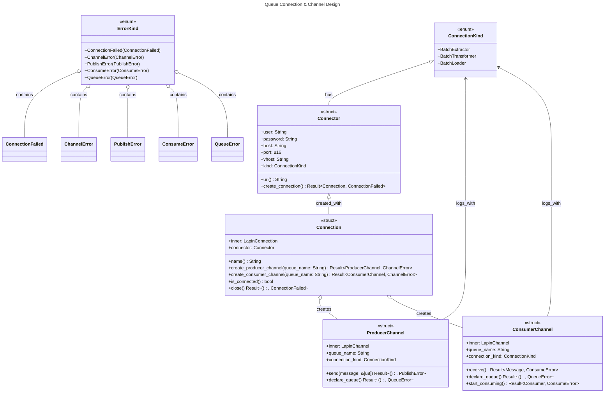

# Queue Connection & Channel Design

## Architecture Overview



## Usage Examples

### Basic Connection and Channel Creation

```rust
use utils::queue::{Connector, ConnectionKind, ConnectorBuilder};

// Create a connector with hardcoded connection type
let connector = ConnectorBuilder::new()
    .user("admin")
    .password("secret")
    .host("localhost")
    .port(5672)
    .vhost("/")
    .kind(ConnectionKind::BatchxExtractor)
    .build();

// Establish connection
let connection = connector.create_connection().await?;

// Create producer channel
let producer = connection.create_producer_channel("batch.extraction.results").await?;
producer.declare_queue().await?;
producer.send(b"Hello, batch!").await?;

// Create consumer channel
let consumer = connection.create_consumer_channel("batch.extraction.results").await?;
consumer.declare_queue().await?;
let message = consumer.receive().await?;
```

### Shared Connection Across Threads

```rust
use std::sync::Arc;
use tokio::task;

let connection = Arc::new(connector.create_connection().await?);

// Producer thread
let producer_connection = Arc::clone(&connection);
let producer_handle = task::spawn(async move {
    let producer = producer_connection
        .create_producer_channel("worker.tasks")
        .await?;
    producer.send(b"task data").await
});

// Consumer thread
let consumer_connection = Arc::clone(&connection);
let consumer_handle = task::spawn(async move {
    let consumer = consumer_connection
        .create_consumer_channel("worker.tasks")
        .await?;
    consumer.receive().await
});

// Wait for both threads
let (producer_result, consumer_result) = tokio::join!(producer_handle, consumer_handle);
```
